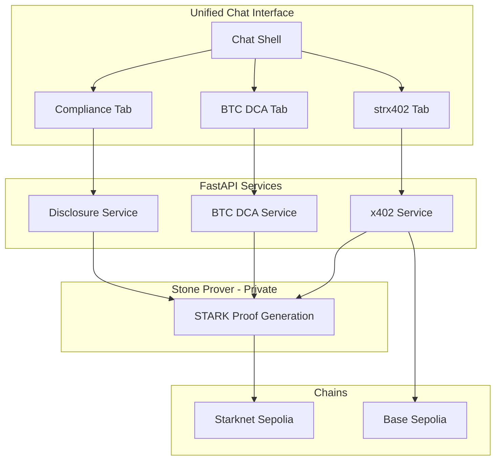

# Obsqra Labs: Verifiable AI Research Stack

## The Big Picture

**One unified demo. Three hackathon tracks. Infinite applications.**

This isn't three separate products. It's a research platform showing how the same core technology (Stone prover + Starknet) powers completely different use cases - proving the stack adapts to any AI system.

| Track | Tab | What It Proves |

|-------|-----|----------------|

| **Open Innovation** | strx402 Agent | Verifiable x402 payments with proof-gating |

| **Bitcoin** | BTC DCA Agent | Trustless wrapped BTC accumulation |

| **Privacy** | Compliance | Selective disclosure - prove facts, hide data |

**The message**: This could be ChatGPT. This could be Claude. This could be Cursor or VSCode. We're showing the research; you imagine the applications.

---

## The Unified Interface

A chat-style interface with three tabs. Each tab demonstrates a different capability of the Obsqra stack. The chat is logic-based (no LLM) - users type commands, agent responds with structured actions and proofs.

```
┌──────────────────────────────────────────────────────────────────────────┐
│  Obsqra Labs Research Demo                              [Connect Wallet] │
├──────────────────────────────────────────────────────────────────────────┤
│                                                                          │
│  ┌─────────────┐ ┌─────────────┐ ┌─────────────┐                        │
│  │  strx402    │ │  BTC DCA    │ │  Compliance │                        │
│  │  ● Active   │ │             │ │             │                        │
│  └─────────────┘ └─────────────┘ └─────────────┘                        │
│                                                                          │
│  ─────────────────────────────────────────────────────────────────────   │
│                                                                          │
│  ┌────────────────────────────────────────────────────────────────────┐ │
│  │                                                                    │ │
│  │  [CHAT AREA - see tab-specific layouts below]                      │ │
│  │                                                                    │ │
│  └────────────────────────────────────────────────────────────────────┘ │
│                                                                          │
│  ┌────────────────────────────────────────────────────────────────────┐ │
│  │  > Type a command...                                    [Send]     │ │
│  └────────────────────────────────────────────────────────────────────┘ │
│                                                                          │
│  ┌────────────────────────────────────────────────────────────────────┐ │
│  │  Quick Commands:  [pay $10]  [check balance]  [generate proof]     │ │
│  └────────────────────────────────────────────────────────────────────┘ │
│                                                                          │
└──────────────────────────────────────────────────────────────────────────┘
```

---

## Tab 1: strx402 Agent (Open Innovation Track)

**Concept**: Verifiable x402 payments. Agent can ONLY pay when a STARK proof verifies it's within constraints.

**Commands**:

- `set limit $50/day` - Set spending constraint
- `pay $10 to 0x...` - Attempt payment (triggers proof generation)
- `status` - Show current spend, remaining limit
- `history` - Show payment history with proofs

**Chat Flow**:

```
┌────────────────────────────────────────────────────────────────────────┐
│  strx402 Agent                                                         │
├────────────────────────────────────────────────────────────────────────┤
│                                                                        │
│  ┌──────────────────────────────────────────────────────────────────┐ │
│  │  You: set limit $50/day                                          │ │
│  └──────────────────────────────────────────────────────────────────┘ │
│                                                                        │
│  ┌──────────────────────────────────────────────────────────────────┐ │
│  │  Agent: Constraint set on Starknet Sepolia                       │ │
│  │                                                                  │ │
│  │  ┌────────────────────────────────────────────────────────────┐ │ │
│  │  │  Daily Limit: $50.00                                       │ │ │
│  │  │  Current Spend: $0.00                                      │ │ │
│  │  │  Remaining: $50.00                                         │ │ │
│  │  │  Status: ● Active                                          │ │ │
│  │  │  [View on Starkscan]                                       │ │ │
│  │  └────────────────────────────────────────────────────────────┘ │ │
│  └──────────────────────────────────────────────────────────────────┘ │
│                                                                        │
│  ┌──────────────────────────────────────────────────────────────────┐ │
│  │  You: pay $10 to 0x742d...                                       │ │
│  └──────────────────────────────────────────────────────────────────┘ │
│                                                                        │
│  ┌──────────────────────────────────────────────────────────────────┐ │
│  │  Agent: Processing payment...                                    │ │
│  │                                                                  │ │
│  │  ┌────────────────────────────────────────────────────────────┐ │ │
│  │  │  Step 1: Generating proof...              ✓ Complete       │ │ │
│  │  │  Step 2: Verifying on Starknet...         ✓ Valid          │ │ │
│  │  │  Step 3: Executing on Base Sepolia...     ✓ Sent           │ │ │
│  │  └────────────────────────────────────────────────────────────┘ │ │
│  │                                                                  │ │
│  │  Payment successful: $10.00 to 0x742d...                         │ │
│  │  Proof: 0x7a3f...  [View]                                        │ │
│  │  Remaining today: $40.00                                         │ │
│  └──────────────────────────────────────────────────────────────────┘ │
│                                                                        │
│  ┌──────────────────────────────────────────────────────────────────┐ │
│  │  You: pay $60 to 0x8b2c...                                       │ │
│  └──────────────────────────────────────────────────────────────────┘ │
│                                                                        │
│  ┌──────────────────────────────────────────────────────────────────┐ │
│  │  Agent: Payment blocked                                          │ │
│  │                                                                  │ │
│  │  ┌────────────────────────────────────────────────────────────┐ │ │
│  │  │  ✗ PROOF FAILED                                            │ │ │
│  │  │                                                            │ │ │
│  │  │  Requested: $60.00                                         │ │ │
│  │  │  Available: $40.00                                         │ │ │
│  │  │  Reason: Would exceed daily limit                          │ │ │
│  │  └────────────────────────────────────────────────────────────┘ │ │
│  │                                                                  │ │
│  │  No proof = No payment. Constraint enforced by mathematics.      │ │
│  └──────────────────────────────────────────────────────────────────┘ │
│                                                                        │
└────────────────────────────────────────────────────────────────────────┘
```

---

## Tab 2: BTC DCA Agent (Bitcoin Track)

**Concept**: Trustless wrapped BTC accumulation. Agent executes DCA strategy with verifiable execution - every purchase is proven on-chain.

**Commands**:

- `setup dca $100/week into WBTC` - Configure DCA strategy
- `execute` - Manually trigger next purchase (or auto)
- `portfolio` - Show BTC holdings and purchase history
- `pause` / `resume` - Control execution

**Chat Flow**:

```
┌────────────────────────────────────────────────────────────────────────┐
│  BTC DCA Agent                                                         │
├────────────────────────────────────────────────────────────────────────┤
│                                                                        │
│  ┌──────────────────────────────────────────────────────────────────┐ │
│  │  You: setup dca $100/week into WBTC                              │ │
│  └──────────────────────────────────────────────────────────────────┘ │
│                                                                        │
│  ┌──────────────────────────────────────────────────────────────────┐ │
│  │  Agent: DCA strategy configured                                  │ │
│  │                                                                  │ │
│  │  ┌────────────────────────────────────────────────────────────┐ │ │
│  │  │  Strategy: Dollar Cost Average                             │ │ │
│  │  │  Amount: $100.00 per week                                  │ │ │
│  │  │  Asset: Wrapped BTC (WBTC)                                 │ │ │
│  │  │  Max Slippage: 1%                                          │ │ │
│  │  │  Verification: Every purchase proven on Starknet           │ │ │
│  │  │  Status: ● Ready                                           │ │ │
│  │  └────────────────────────────────────────────────────────────┘ │ │
│  └──────────────────────────────────────────────────────────────────┘ │
│                                                                        │
│  ┌──────────────────────────────────────────────────────────────────┐ │
│  │  You: execute                                                    │ │
│  └──────────────────────────────────────────────────────────────────┘ │
│                                                                        │
│  ┌──────────────────────────────────────────────────────────────────┐ │
│  │  Agent: Executing DCA purchase...                                │ │
│  │                                                                  │ │
│  │  ┌────────────────────────────────────────────────────────────┐ │ │
│  │  │  Step 1: Generating execution proof...    ✓ Complete       │ │ │
│  │  │  Step 2: Verifying constraints...         ✓ Valid          │ │ │
│  │  │  Step 3: Swapping USDC → WBTC...          ✓ Executed       │ │ │
│  │  └────────────────────────────────────────────────────────────┘ │ │
│  │                                                                  │ │
│  │  Purchase complete:                                              │ │
│  │  Spent: $100.00 USDC                                             │ │
│  │  Received: 0.00098 WBTC                                          │ │
│  │  Price: $102,040/BTC                                             │ │
│  │  Slippage: 0.3% (within 1% limit)                                │ │
│  │  Proof: 0x9f2e...  [View on Starkscan]                           │ │
│  └──────────────────────────────────────────────────────────────────┘ │
│                                                                        │
│  ┌──────────────────────────────────────────────────────────────────┐ │
│  │  You: portfolio                                                  │ │
│  └──────────────────────────────────────────────────────────────────┘ │
│                                                                        │
│  ┌──────────────────────────────────────────────────────────────────┐ │
│  │  Agent: Your BTC Portfolio                                       │ │
│  │                                                                  │ │
│  │  ┌────────────────────────────────────────────────────────────┐ │ │
│  │  │  Total WBTC: 0.00392                                       │ │ │
│  │  │  Total Invested: $400.00                                   │ │ │
│  │  │  Current Value: $399.84                                    │ │ │
│  │  │  Avg Buy Price: $102,040                                   │ │ │
│  │  │                                                            │ │ │
│  │  │  Purchases: 4 (all verified on-chain)                      │ │ │
│  │  │  ├─ Week 1: 0.00098 @ $102,040  [proof: 0x9f2e...]         │ │ │
│  │  │  ├─ Week 2: 0.00099 @ $101,010  [proof: 0x8b4e...]         │ │ │
│  │  │  ├─ Week 3: 0.00097 @ $103,090  [proof: 0x7a3f...]         │ │ │
│  │  │  └─ Week 4: 0.00098 @ $102,040  [proof: 0x6c2d...]         │ │ │
│  │  └────────────────────────────────────────────────────────────┘ │ │
│  └──────────────────────────────────────────────────────────────────┘ │
│                                                                        │
└────────────────────────────────────────────────────────────────────────┘
```

---

## Tab 3: Compliance (Privacy Track)

**Concept**: Selective disclosure. Prove facts about your activity without revealing the underlying data.

**Commands**:

- `prove volume below $10000` - Generate volume threshold proof
- `prove compliant with policy 0x...` - Prove policy adherence
- `list proofs` - Show generated proofs
- `share proof 0x... with [address]` - Share proof with verifier

**Chat Flow**:

```
┌────────────────────────────────────────────────────────────────────────┐
│  Compliance - Selective Disclosure                                     │
├────────────────────────────────────────────────────────────────────────┤
│                                                                        │
│  ┌──────────────────────────────────────────────────────────────────┐ │
│  │  You: prove volume below $10000                                  │ │
│  └──────────────────────────────────────────────────────────────────┘ │
│                                                                        │
│  ┌──────────────────────────────────────────────────────────────────┐ │
│  │  Agent: Generating selective disclosure proof...                 │ │
│  │                                                                  │ │
│  │  ┌────────────────────────────────────────────────────────────┐ │ │
│  │  │  Analyzing transactions...                ✓ 47 txns found  │ │ │
│  │  │  Computing total volume...                ✓ Complete       │ │ │
│  │  │  Generating STARK proof...                ✓ Generated      │ │ │
│  │  │  Anchoring to Starknet...                 ✓ Verified       │ │ │
│  │  └────────────────────────────────────────────────────────────┘ │ │
│  │                                                                  │ │
│  │  ┌────────────────────────────────────────────────────────────┐ │ │
│  │  │  DISCLOSURE PROOF                                          │ │ │
│  │  │                                                            │ │ │
│  │  │  Statement: "Total volume is below $10,000"                │ │ │
│  │  │  Result: TRUE                                              │ │ │
│  │  │  Proof Hash: 0x9f2e...                                     │ │ │
│  │  │  Verified On-Chain: Yes                                    │ │ │
│  │  │                                                            │ │ │
│  │  │  ┌──────────────────────────────────────────────────────┐ │ │ │
│  │  │  │  What the verifier sees:                             │ │ │ │
│  │  │  │  ✓ Volume is below $10,000                           │ │ │ │
│  │  │  │  ✓ Proof is valid                                    │ │ │ │
│  │  │  │                                                      │ │ │ │
│  │  │  │  What remains private:                               │ │ │ │
│  │  │  │  ✗ Actual volume ($847.32)                           │ │ │ │
│  │  │  │  ✗ Number of transactions (47)                       │ │ │ │
│  │  │  │  ✗ Individual transaction details                    │ │ │ │
│  │  │  │  ✗ Counterparty addresses                            │ │ │ │
│  │  │  └──────────────────────────────────────────────────────┘ │ │ │
│  │  └────────────────────────────────────────────────────────────┘ │ │
│  │                                                                  │ │
│  │  [Copy Proof]  [Share with Verifier]  [View on Starkscan]        │ │
│  └──────────────────────────────────────────────────────────────────┘ │
│                                                                        │
└────────────────────────────────────────────────────────────────────────┘
```

---

## The Story We're Telling

### For Judges

"This is a research demo from Obsqra Labs. We built one core technology - verifiable, trustless AI execution - and showed it powering three completely different use cases:

1. **Autonomous payments** that can't overspend (strx402)
2. **BTCFi accumulation** with every trade proven (BTC DCA)
3. **Privacy-preserving compliance** that satisfies regulators without exposing data

The same stack. Three applications. Imagine this in ChatGPT, Claude, Cursor, or any AI system that needs trust."

### For Users

"Don't trust the agent. Verify the proof."

---

## Architecture



---

## What We're Building

### Frontend

- Unified chat interface at `/research-demo`
- Three tabs with distinct functionality
- Logic-based command parsing (no LLM)
- Real-time proof status and transaction logs

### Backend Services

- `x402_service.py` - Proof-gated x402 payments
- `btc_dca_service.py` - Wrapped BTC DCA execution
- `disclosure_service.py` - Selective disclosure proofs

### On-Chain

- Existing AgentOrchestrator (Starknet Sepolia)
- Proof verification contracts
- WBTC integration for DCA

---

## Timeline

| Phase | Days | Focus |

|-------|------|-------|

| Chat Shell | 1-4 | Unified interface, tab navigation, command parsing |

| strx402 | 5-10 | x402 service, proof-gated payments |

| BTC DCA | 11-16 | WBTC integration, DCA execution |

| Compliance | 17-20 | Selective disclosure proofs |

| Polish | 21-25 | UX, error handling, edge cases |

| Ship | 26-28 | Demo video, README, submission |

---

## Why This Wins All Three Tracks

**Open Innovation (strx402)**

- First verifiable x402 agent with STARK proof-gating
- Real cross-chain flow: Starknet + Base

**Bitcoin (BTC DCA)**

- Trustless WBTC accumulation
- Every purchase proven on-chain

**Privacy (Compliance)**

- Selective disclosure without data exposure
- Regulators get answers, users keep privacy

**Across All Tracks**

- Same core technology, different applications
- Shows adaptability to any AI system
- Production-ready prover stack

---

## What's in the Public Repo

- Frontend chat interface
- Backend API services (prover is black box)
- AgentOrchestrator contract
- Cairo constraint programs
- Architecture documentation

**What stays private**: Stone prover internals, proving infrastructure