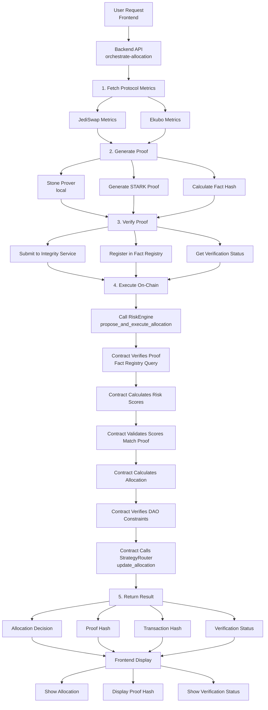
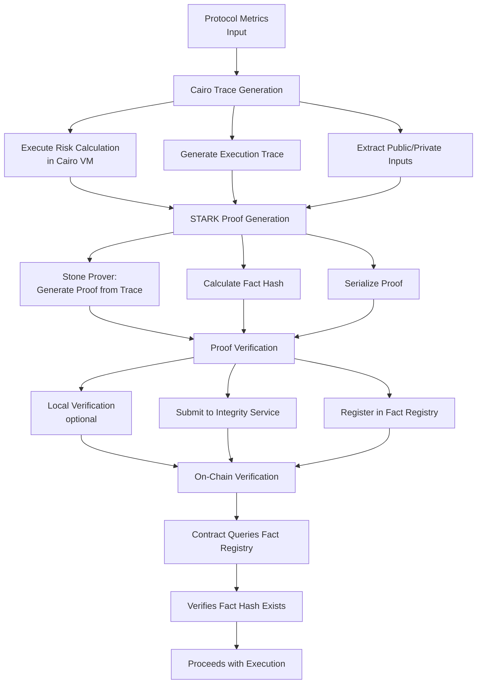

# System Architecture Overview

## High-Level Architecture

Obsqra implements a three-layer architecture for verifiable AI decision-making on Starknet:

```
┌─────────────────────────────────────────────────────────────┐
│                    Frontend Layer (Next.js)                  │
│  ┌──────────────┐  ┌──────────────┐  ┌──────────────────┐   │
│  │  Dashboard   │  │ Transparency │  │  Governance UI   │   │
│  │  Components  │  │   Dashboard  │  │   Components    │   │
│  └──────────────┘  └──────────────┘  └──────────────────┘   │
└─────────────────────────────────────────────────────────────┘
                            │
                            ▼ HTTP/REST API
┌─────────────────────────────────────────────────────────────┐
│              Backend Layer (Python/FastAPI)                  │
│  ┌──────────────────────────────────────────────────────┐   │
│  │  Proof Generation Services                            │   │
│  │  - Stone Prover Service (local)                      │   │
│  │  - LuminAIR Service (alternative)                    │   │
│  └──────────────────────────────────────────────────────┘   │
│  ┌──────────────────────────────────────────────────────┐   │
│  │  Verification Services                               │   │
│  │  - Integrity Service (Herodotus)                    │   │
│  │  - Model Service (hash calculation)                 │   │
│  └──────────────────────────────────────────────────────┘   │
│  ┌──────────────────────────────────────────────────────┐   │
│  │  Orchestration Services                              │   │
│  │  - Risk Engine API                                   │   │
│  │  - Allocation Proposal Service                       │   │
│  └──────────────────────────────────────────────────────┘   │
└─────────────────────────────────────────────────────────────┘
                            │
                            ▼ Starknet RPC
┌─────────────────────────────────────────────────────────────┐
│         Smart Contract Layer (Cairo on Starknet)            │
│  ┌──────────────┐  ┌──────────────┐  ┌──────────────────┐  │
│  │ RiskEngine   │  │  Strategy    │  │   Model         │  │
│  │  (v4)        │──│   Router      │  │   Registry      │  │
│  │              │  │  (v3.5)      │  │                 │  │
│  └──────────────┘  └──────────────┘  └──────────────────┘  │
│         │                │                    │              │
│         └────────────────┴────────────────────┘            │
│                            │                                 │
│                            ▼                                 │
│              ┌──────────────────────────┐                    │
│              │  SHARP Fact Registry     │                    │
│              │  (Proof Verification)    │                    │
│              └──────────────────────────┘                    │
│                            │                                 │
│                            ▼                                 │
│              ┌──────────────────────────┐                    │
│              │  Protocol Integrations    │                    │
│              │  - JediSwap              │                    │
│              │  - Ekubo                 │                    │
│              └──────────────────────────┘                    │
└─────────────────────────────────────────────────────────────┘
```

## Component Overview

### Frontend Layer

**Technology:** Next.js 14, TypeScript, Tailwind CSS

**Key Components:**
- **Dashboard**: User portfolio, allocations, performance
- **Transparency Dashboard**: Proof hashes, model versions, verification status
- **Governance UI**: DAO constraint management, model upgrades
- **Wallet Integration**: Starknet wallet connection (Argent X, Braavos)

**Responsibilities:**
- User interface and interaction
- Wallet connection and transaction signing
- Display of proof and verification information
- Real-time status updates

### Backend Layer

**Technology:** Python 3.11+, FastAPI, PostgreSQL

**Key Services:**

1. **Proof Generation Services**
   - `StoneProverService`: Local STARK proof generation
   - `LuminAIRService`: Alternative prover integration
   - `AllocationProofOrchestrator`: Routes between provers

2. **Verification Services**
   - `IntegrityService`: Herodotus Integrity integration
   - `ModelService`: Model hash calculation
   - `VerificationService`: Proof verification status

3. **Orchestration Services**
   - `RiskEngineAPI`: REST API endpoints
   - `AllocationProposalService`: End-to-end workflow
   - `ProtocolMetricsService`: Protocol data aggregation

**Responsibilities:**
- Proof generation and verification
- Transaction orchestration
- Database management
- API endpoints

### Smart Contract Layer

**Technology:** Cairo 2.11.0, Starknet

**Key Contracts:**

1. **RiskEngine (v4)**
   - Address: `0x000ee68bae3346502c97a79ac575b7c5c5839c1bb79a18cbd2717ea0126a09d4`
   - Risk score calculation
   - Allocation optimization
   - **On-chain proof verification gate**
   - DAO constraint enforcement

2. **StrategyRouter (v3.5)**
   - Address: `0x0221284a7b77041f9f963c0f0b65b901604792533f0f937aa4591bd43d08ee2b`
   - Fund management (deposit/withdraw)
   - Protocol allocation execution
   - MIST.cash privacy integration
   - Yield accrual tracking

3. **ModelRegistry**
   - Address: `0x06ab2595007be01ffb7e51bd28339f870be36402eed9034b109fd479e7469adc`
   - Model version tracking
   - Model hash commitments
   - Upgrade history

4. **DAOConstraintManager**
   - Governance parameter storage
   - Constraint validation
   - Parameter updates

5. **SHARP Fact Registry**
   - Proof verification registry
   - Fact hash storage
   - On-chain verification queries

**Responsibilities:**
- On-chain computation and verification
- Fund management and execution
- Model provenance tracking
- Governance enforcement

## Data Flow Diagram

### End-to-End Allocation Flow



### Proof Generation Flow



## Key Contracts and Their Roles

### RiskEngine Contract

**Primary Role:** Core decision engine with on-chain verification

**Key Functions:**
- `calculate_risk_score()`: Multi-factor risk calculation
- `calculate_allocation()`: Risk-adjusted allocation optimization
- `propose_and_execute_allocation()`: Full orchestration with proof verification
- `verify_constraints()`: DAO constraint validation

**Verification Gate:**
- Accepts proof fact hashes as parameters
- Queries SHARP Fact Registry
- Verifies proofs before execution
- Validates risk scores match proof

### StrategyRouter Contract

**Primary Role:** Fund management and protocol execution

**Key Functions:**
- `deposit()`: User deposits
- `withdraw()`: User withdrawals
- `update_allocation()`: Rebalance funds (RiskEngine only)
- `deploy_to_protocols()`: Protocol integration
- `accrue_yields()`: Yield tracking

**Privacy Integration:**
- MIST.cash hash commitments
- Private deposit/withdrawal patterns

### ModelRegistry Contract

**Primary Role:** Model provenance and versioning

**Key Functions:**
- `register_model_version()`: Register new model version
- `get_current_model()`: Get active model
- `get_model_version()`: Query specific version
- `get_model_history()`: Version history

### DAOConstraintManager Contract

**Primary Role:** Governance parameter storage

**Key Functions:**
- Constraint storage (min/max allocations, risk limits)
- Constraint validation
- Parameter updates (owner only)

## Technology Stack

### Frontend
- **Framework:** Next.js 14 (App Router)
- **Language:** TypeScript
- **Styling:** Tailwind CSS
- **Starknet Integration:** @starknet-react/core
- **State Management:** React Context, Hooks

### Backend
- **Framework:** FastAPI
- **Language:** Python 3.11+
- **Database:** PostgreSQL
- **ORM:** SQLAlchemy
- **Starknet Integration:** starknet.py

### Smart Contracts
- **Language:** Cairo 2.11.0
- **Compiler:** Scarb
- **Network:** Starknet Sepolia (testnet)
- **Deployment:** sncast / starkli

### Proof Generation
- **Primary:** Stone Prover (local)
- **Alternative:** LuminAIR
- **Verification:** Herodotus Integrity
- **Registry:** SHARP Fact Registry

## Network Architecture

### Starknet Sepolia (Testnet)

**Current Deployment:**
- All contracts deployed to Sepolia
- RPC endpoint: `https://starknet-sepolia-rpc.publicnode.com`
- Explorer: https://sepolia.starkscan.co

**Protocol Integrations:**
- JediSwap: Sepolia deployment
- Ekubo: Sepolia deployment
- STRK Token: Sepolia test token

### Future: Mainnet

**Planned:**
- Mainnet deployment after testing
- Production RPC endpoints
- Mainnet protocol integrations

## Integration Points

### External Services

1. **Herodotus Integrity**
   - Proof verification service
   - Fact Registry deployment
   - L2 proof verification

2. **SHARP (StarkWare)**
   - Public fact registry
   - Proof verification infrastructure
   - On-chain verification

3. **Protocol APIs**
   - JediSwap: AMM data
   - Ekubo: Concentrated liquidity data
   - APY and metrics fetching

### Internal Services

1. **Database (PostgreSQL)**
   - Proof job tracking
   - Verification status
   - Performance metrics

2. **RPC Endpoints**
   - Starknet RPC (contract calls)
   - Data RPC (read-only queries)
   - Failover support

## Next Steps

- **[Architecture Deep Dive](../03-architecture/01-system-overview.md)** - Detailed component analysis
- **[Smart Contracts](../03-architecture/02-smart-contracts.md)** - Contract architecture
- **[Backend Services](../03-architecture/03-backend-services.md)** - Service layer details
- **[Proof Generation](../03-architecture/04-proof-generation.md)** - Proof pipeline

---

**Architecture Summary:** Three-layer system (Frontend → Backend → Contracts) with proof generation, verification, and on-chain execution, all integrated for trustless, verifiable AI decision-making.
