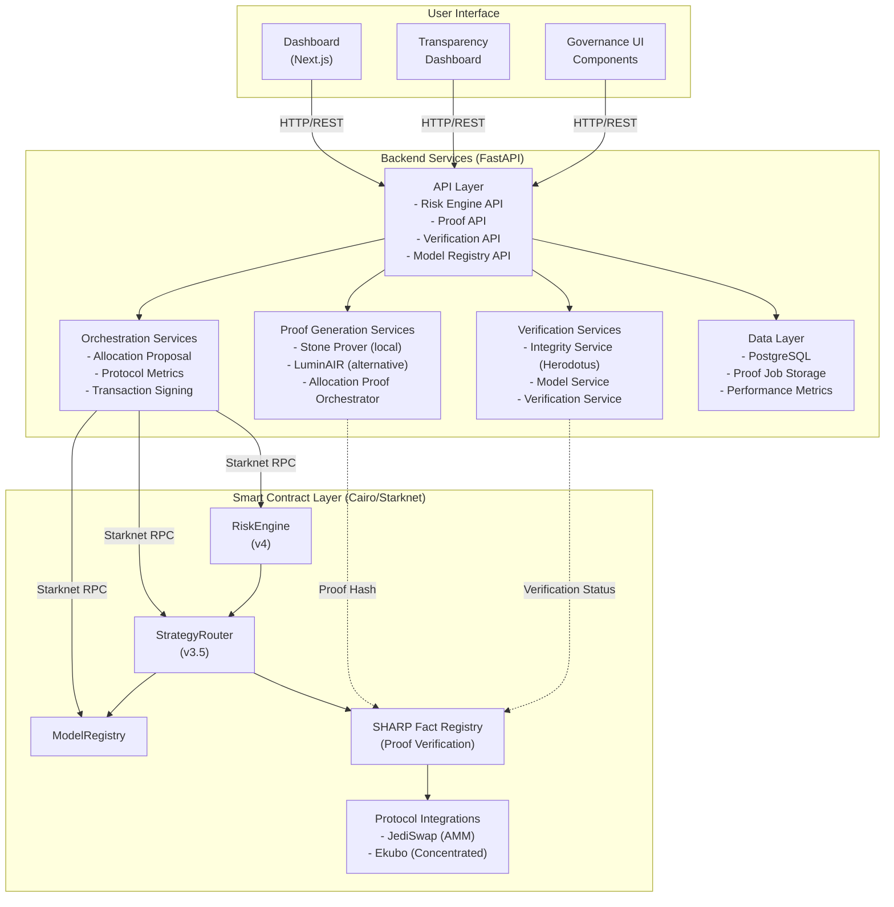
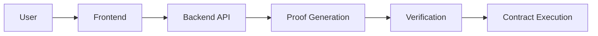
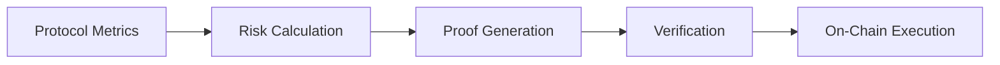

# System Overview

This document provides a comprehensive overview of the Obsqra zkML system architecture, components, technology stack, and integration points.

## System Components Diagram

## Technology Stack

### Frontend Layer

**Framework:** Next.js 14 (App Router)
- **Language:** TypeScript
- **Styling:** Tailwind CSS
- **State Management:** React Context, Hooks
- **Starknet Integration:** @starknet-react/core
- **Build Tool:** Next.js built-in bundler

**Key Libraries:**
- `@starknet-react/core`: Starknet wallet integration
- `starknet`: Starknet.js for contract interactions
- `react-query`: Data fetching and caching

### Backend Layer

**Framework:** FastAPI (Python 3.11+)
- **Language:** Python 3.11+
- **API:** RESTful API with OpenAPI docs
- **Database:** PostgreSQL with SQLAlchemy ORM
- **Starknet Integration:** starknet.py

**Key Services:**
- `stone_prover_service.py`: Local STARK proof generation
- `luminair_service.py`: Alternative prover integration
- `integrity_service.py`: Herodotus Integrity integration
- `model_service.py`: Model hash calculation
- `risk_engine.py`: API endpoints for allocations

**Key Libraries:**
- `fastapi`: Web framework
- `starknet.py`: Starknet Python SDK
- `sqlalchemy`: Database ORM
- `pydantic`: Data validation

### Smart Contract Layer

**Language:** Cairo 2.11.0
- **Compiler:** Scarb
- **Network:** Starknet Sepolia (testnet)
- **Deployment:** sncast / starkli

**Key Contracts:**
- `risk_engine.cairo`: Core risk assessment and verification
- `strategy_router_v3_5.cairo`: Fund management and execution
- `model_registry.cairo`: Model provenance tracking
- `dao_constraint_manager.cairo`: Governance parameters
- `sharp_verifier.cairo`: On-chain proof verification

### Proof Generation

**Primary Prover:** Stone Prover (local)
- **Language:** C++ (StarkWare's prover)
- **Generation Time:** 2-4 seconds
- **Cost:** $0 (local execution)
- **Success Rate:** 100% (100/100 tested)

**Alternative Prover:** LuminAIR
- **Language:** Rust
- **Generation Time:** Similar to Stone
- **Fallback:** Used if Stone unavailable

**Verification:** Herodotus Integrity
- **Service:** Atlantic API
- **Fact Registry:** SHARP Fact Registry
- **On-Chain:** Fact Registry contract

## Network Architecture

### Starknet Sepolia (Testnet)

**Current Deployment:**
- All contracts deployed to Sepolia
- RPC endpoint: `https://starknet-sepolia-rpc.publicnode.com`
- Explorer: https://sepolia.starkscan.co

**Contract Addresses:**
- **RiskEngine v4:** `0x000ee68bae3346502c97a79ac575b7c5c5839c1bb79a18cbd2717ea0126a09d4`
- **StrategyRouter v3.5:** `0x0221284a7b77041f9f963c0f0b65b901604792533f0f937aa4591bd43d08ee2b`
- **ModelRegistry:** `0x06ab2595007be01ffb7e51bd28339f870be36402eed9034b109fd479e7469adc`
- **FactRegistry:** `0x063feefb4b7cfb46b89d589a8b00bceb7905a7d51c4e8068d4b45e0d9d018f64`

**Protocol Integrations:**
- **JediSwap Router:** `0x03c8e56d7f6afccb775160f1ae3b69e3db31b443e544e56bd845d8b3b3a87a21`
- **Ekubo Core:** `0x0444a09d96389aa7148f1aada508e30b71299ffe650d9c97fdaae38cb9a23384`
- **STRK Token:** `0x04718f5a0fc34cc1af16a1cdee98ffb20c31f5cd61d6ab07201858f36c338bb1`

### Network Configuration

**RPC Endpoints:**
- Primary: `https://starknet-sepolia-rpc.publicnode.com`
- Failover: Configurable via `STARKNET_RPC_URLS`
- Retry: Automatic with backoff

**Network Settings:**
- Chain ID: `SN_SEPOLIA`
- Block Time: ~12 seconds
- Gas Currency: STRK
- Transaction Fees: $0.001-0.01 STRK

## Integration Points

### External Services

**1. Herodotus Integrity (Atlantic API)**
- **Purpose:** Proof verification and fact registration
- **Endpoint:** `https://atlantic.api.herodotus.cloud`
- **Authentication:** API key required
- **Function:** Verifies proofs and registers fact hashes

**2. SHARP Fact Registry**
- **Purpose:** On-chain proof verification registry
- **Address:** `0x063feefb4b7cfb46b89d589a8b00bceb7905a7d51c4e8068d4b45e0d9d018f64`
- **Function:** Stores verified computation facts
- **Query:** Contracts query registry for proof verification

**3. Protocol APIs**
- **JediSwap:** AMM data, pool information, APY
- **Ekubo:** Concentrated liquidity data, positions, APY
- **Function:** Real-time protocol metrics

### Internal Services

**1. PostgreSQL Database**
- **Purpose:** Proof job tracking, verification status, performance metrics
- **Schema:** ProofJob, AllocationDecision, PerformanceSnapshot
- **Function:** Persistent storage of proof and allocation data

**2. Stone Prover Binary**
- **Location:** Local filesystem
- **Purpose:** STARK proof generation
- **Function:** Generates proofs from Cairo execution traces

**3. Backend Wallet**
- **Purpose:** Automated transaction signing
- **Storage:** Encrypted private key
- **Function:** Signs transactions for allocation execution

## Component Interactions

### Request Flow

**Detailed Flow:**
1. User clicks "Orchestrate Allocation" in frontend
2. Frontend sends HTTP request to backend API
3. Backend fetches protocol metrics
4. Backend generates STARK proof (Stone Prover)
5. Backend verifies proof (Integrity Service)
6. Backend submits transaction to RiskEngine contract
7. Contract verifies proof on-chain (Fact Registry)
8. Contract executes allocation
9. Contract emits events
10. Frontend displays results

### Data Flow

**Data Transformation:**
1. **Input:** Protocol metrics (utilization, volatility, etc.)
2. **Processing:** Risk score calculation (deterministic)
3. **Proof:** STARK proof generation (cryptographic)
4. **Verification:** Fact hash registration (on-chain)
5. **Execution:** Allocation execution (contract)

## System Boundaries

### Trust Boundaries

**Trusted Components:**
- User's wallet (private key management)
- Backend database (proof job storage)
- Stone prover binary (proof generation)

**Trustless Components:**
- Smart contracts (on-chain verification)
- Fact Registry (public verification)
- Proof verification (cryptographic)

### Security Boundaries

**On-Chain Security:**
- Contract-level proof verification
- Immutable execution
- Public auditability

**Off-Chain Security:**
- Encrypted private keys
- Secure API endpoints
- Database access control

## Scalability Considerations

### Current Limitations

- Two protocol support (JediSwap, Ekubo)
- Single backend instance
- Local proof generation (single machine)
- Sepolia testnet deployment

### Scalability Path

**Horizontal Scaling:**
- Multiple backend instances
- Load balancing
- Database replication

**Proof Generation:**
- Distributed proof generation
- Proof batching
- Caching strategies

**Protocol Expansion:**
- Generic protocol adapter
- Dynamic protocol addition
- Multi-protocol optimization

## Monitoring and Observability

### Metrics

**Backend Metrics:**
- Proof generation time
- Verification success rate
- API request latency
- Database query performance

**Contract Metrics:**
- Transaction success rate
- Gas usage
- Event emission
- Verification failures

**System Metrics:**
- Service uptime
- Error rates
- Resource utilization
- Network connectivity

### Logging

**Backend Logs:**
- API requests/responses
- Proof generation logs
- Verification status
- Error traces

**Contract Logs:**
- Event emissions
- Transaction hashes
- Verification results
- Execution status

## Next Steps

- **[Smart Contracts](02-smart-contracts.md)** - Detailed contract architecture
- **[Backend Services](03-backend-services.md)** - Service layer details
- **[Proof Generation](04-proof-generation.md)** - Proof pipeline
- **[On-Chain Verification](05-on-chain-verification.md)** - Verification architecture
- **[Data Flow](06-data-flow.md)** - End-to-end data flow

---

**System Summary:** Three-layer architecture (Frontend → Backend → Contracts) with proof generation, verification, and on-chain execution, all integrated for trustless, verifiable AI decision-making on Starknet.
