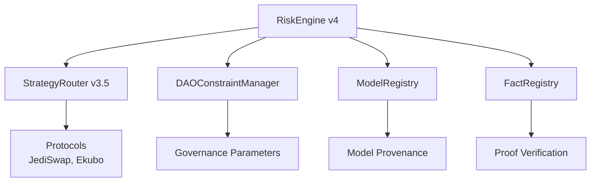

# Smart Contracts Architecture

This document details the smart contract architecture, including RiskEngine, StrategyRouter, ModelRegistry, DAOConstraintManager, and FactRegistry integration.

## Contract Architecture Overview

The Obsqra system consists of five main contracts working together:



## RiskEngine Contract (v4)

**Address:** `0x000ee68bae3346502c97a79ac575b7c5c5839c1bb79a18cbd2717ea0126a09d4`

**Purpose:** Core risk assessment and allocation decision engine with on-chain proof verification gate.

### Key Functions

**1. `calculate_risk_score(metrics: ProtocolMetrics) -> felt252`**
- Computes risk score (5-95 scale)
- Formula: `(util*35 + vol*30 + liq*5 + audit*20 + age_penalty) / 10000`
- Deterministic calculation
- Used for both on-chain and proof generation

**2. `calculate_allocation(risks, apys) -> (felt252, felt252)`**
- Risk-adjusted allocation optimization
- Formula: `Allocation = (APY * 10000) / (Risk + 1)`
- Returns JediSwap and Ekubo percentages
- Sums to 100%

**3. `propose_and_execute_allocation(...) -> AllocationDecision`**
- **STEP 0: VERIFY PROOFS** (NEW in v4)
  - Accepts proof fact hashes
  - Queries SHARP Fact Registry
  - Verifies proofs exist and are valid
  - Validates risk scores match proof
- **STEP 1:** Calculate risk scores on-chain
- **STEP 2:** Verify scores match proof
- **STEP 3:** Calculate allocation
- **STEP 4:** Verify DAO constraints
- **STEP 5:** Execute via StrategyRouter
- **STEP 6:** Emit events

**4. `verify_constraints(...) -> bool`**
- Validates allocation against DAO constraints
- Checks max single protocol limit
- Verifies minimum diversification
- Returns true if valid

### Storage

```cairo
struct Storage {
    owner: ContractAddress,
    strategy_router: ContractAddress,
    dao_manager: ContractAddress,
    decision_count: felt252,
    current_decision: AllocationDecision,
    current_model_hash: felt252,
    // ... performance tracking
}
```

### Events

- `AllocationProposed`: Decision proposed with proof
- `AllocationExecuted`: Allocation executed on-chain
- `ConstraintsValidated`: DAO constraints verified
- `ModelHashUpdated`: Model version changed

### On-Chain Verification Gate

**Critical Feature:** Contract verifies proofs before execution

```cairo
// STEP 0: VERIFY PROOFS
let proofs_valid = verify_allocation_decision_with_proofs(
    jediswap_metrics,
    ekubo_metrics,
    jediswap_proof_fact,
    ekubo_proof_fact,
    expected_jediswap_score,
    expected_ekubo_score,
    fact_registry_address
);

assert(proofs_valid, 0); // Revert if proofs not verified
```

## StrategyRouter Contract (v3.5)

**Address:** `0x0221284a7b77041f9f963c0f0b65b901604792533f0f937aa4591bd43d08ee2b`

**Purpose:** Fund management, protocol execution, and MIST.cash privacy integration.

### Key Functions

**1. `deposit(amount: u256)`**
- User deposits STRK tokens
- Updates `user_balances` map
- Tracks total deposited
- Does NOT automatically deploy to protocols

**2. `withdraw(amount: u256) -> u256`**
- User withdraws funds
- Proportional withdrawal from protocols
- Returns STRK + accrued yield
- Updates user balance

**3. `update_allocation(jediswap_pct, ekubo_pct)`**
- **Access Control:** Only RiskEngine can call
- Rebalances funds across protocols
- Updates allocation percentages
- Executes protocol integrations

**4. `deploy_to_protocols()`**
- Separate action after deposit
- Allocates funds to JediSwap and Ekubo
- Creates liquidity positions
- Tracks positions

**5. MIST.cash Privacy Functions:**
- `commit_mist_deposit(commitment_hash, expected_amount)`
- `reveal_and_claim_mist_deposit(secret) -> (address, amount)`
- `get_mist_commitment(commitment_hash) -> (address, amount, claimed)`

### Storage

```cairo
struct Storage {
    owner: ContractAddress,
    risk_engine: ContractAddress,
    jediswap_router: ContractAddress,
    ekubo_core: ContractAddress,
    total_deposited: u256,
    jediswap_pct: felt252,
    ekubo_pct: felt252,
    user_balances: Map<ContractAddress, u256>, // Per-user balances
    // ... protocol positions, yields, etc.
}
```

### Protocol Integration

**JediSwap:**
- AMM liquidity provision
- NFT position management
- Fee collection
- Position tracking

**Ekubo:**
- Concentrated liquidity
- Position management
- Fee accrual
- Liquidity tracking

## ModelRegistry Contract

**Address:** `0x06ab2595007be01ffb7e51bd28339f870be36402eed9034b109fd479e7469adc`

**Purpose:** Model provenance tracking and version management.

### Key Functions

**1. `register_model_version(version, model_hash, description) -> ModelVersion`**
- **Access Control:** Owner only
- Registers new model version
- Updates current version
- Emits `ModelRegistered` event
- Returns registered model

**2. `get_current_model() -> ModelVersion`**
- Returns active model version
- Includes version, hash, deployment date
- Returns empty if no model registered

**3. `get_model_version(version) -> Option<ModelVersion>`**
- Queries specific version
- Returns `Option::Some` if exists
- Returns `Option::None` if not found

**4. `get_model_history() -> Span<felt252>`**
- Returns all version numbers
- Chronological order
- Callers can query full models

### Storage

```cairo
struct Storage {
    owner: ContractAddress,
    current_version: felt252,
    model_versions: Map<felt252, ModelVersion>,
    version_count: felt252,
    versions_by_index: Map<felt252, felt252>, // index -> version
}
```

### ModelVersion Structure

```cairo
struct ModelVersion {
    version: felt252,
    model_hash: felt252,
    deployed_at: u64,
    description: ByteArray,
    is_active: bool,
}
```

## DAOConstraintManager Contract

**Purpose:** Governance parameter storage and validation.

### Key Functions

**1. Constraint Storage:**
- `max_single_protocol`: Maximum allocation per protocol
- `min_diversification`: Minimum spread requirement
- `max_volatility`: Maximum volatility threshold
- `min_liquidity`: Minimum liquidity requirement

**2. Access Control:**
- Owner can update constraints
- RiskEngine reads for validation
- Transparent parameter history

### Storage

```cairo
struct Storage {
    owner: ContractAddress,
    max_single: felt252,
    min_diversification: felt252,
    max_volatility: felt252,
    min_liquidity: felt252,
}
```

## FactRegistry Integration

**Address:** `0x063feefb4b7cfb46b89d589a8b00bceb7905a7d51c4e8068d4b45e0d9d018f64`

**Purpose:** On-chain proof verification registry (SHARP).

### Interface

```cairo
trait IFactRegistry<TContractState> {
    fn get_all_verifications_for_fact_hash(
        self: @TContractState,
        fact_hash: felt252
    ) -> Span<felt252>;
}
```

### Verification Logic

**In RiskEngine:**
```cairo
let registry = IFactRegistryDispatcher {
    contract_address: fact_registry_address
};

let verifications = registry.get_all_verifications_for_fact_hash(proof_fact);
let len = verifications.len();

if len == 0 {
    return false; // Not verified
}
// Verified if array is non-empty
```

## Contract Interaction Flows

### Allocation Execution Flow

```
1. User/Backend calls RiskEngine.propose_and_execute_allocation()
   ↓
2. RiskEngine verifies proofs (FactRegistry query)
   ↓
3. RiskEngine calculates risk scores
   ↓
4. RiskEngine validates scores match proof
   ↓
5. RiskEngine calculates allocation
   ↓
6. RiskEngine queries DAOConstraintManager
   ↓
7. RiskEngine verifies constraints
   ↓
8. RiskEngine calls StrategyRouter.update_allocation()
   ↓
9. StrategyRouter rebalances funds
   ↓
10. StrategyRouter integrates with protocols
```

### Model Upgrade Flow

```
1. Owner calls ModelRegistry.register_model_version()
   ↓
2. ModelRegistry stores new version
   ↓
3. ModelRegistry updates current_version
   ↓
4. ModelRegistry emits ModelRegistered event
   ↓
5. RiskEngine reads new model_hash
   ↓
6. Future allocations use new model
```

### Proof Verification Flow

```
1. Backend generates proof
   ↓
2. Backend submits to Integrity Service
   ↓
3. Integrity Service registers in FactRegistry
   ↓
4. Backend calls RiskEngine with fact_hash
   ↓
5. RiskEngine queries FactRegistry
   ↓
6. FactRegistry returns verifications array
   ↓
7. RiskEngine verifies array is non-empty
   ↓
8. RiskEngine proceeds with execution
```

## Access Control

### Contract Owners

- **RiskEngine:** Can update strategy_router reference
- **StrategyRouter:** Can update protocol addresses
- **ModelRegistry:** Can register new model versions
- **DAOConstraintManager:** Can update constraints

### Function Access

- **StrategyRouter.update_allocation():** RiskEngine only
- **ModelRegistry.register_model_version():** Owner only
- **DAOConstraintManager updates:** Owner only
- **User deposits/withdrawals:** Public

## Security Considerations

### On-Chain Verification

- Proofs must be verified before execution
- Risk scores must match proof
- Constraints must be satisfied
- No execution without valid proof

### Access Control

- Owner-only functions protected
- RiskEngine-only functions protected
- Public functions validated
- No unauthorized access

### State Management

- Immutable model versions
- Permanent audit trail
- Transparent constraints
- Verifiable decisions

## Next Steps

- **[Backend Services](03-backend-services.md)** - Service layer architecture
- **[Proof Generation](04-proof-generation.md)** - Proof pipeline
- **[On-Chain Verification](05-on-chain-verification.md)** - Verification details
- **[Contract Reference](../07-contract-reference/01-risk-engine.md)** - Detailed function reference

---

**Contract Summary:** Five contracts working together to provide verifiable AI decision-making with on-chain proof verification, model provenance, and governance enforcement.
