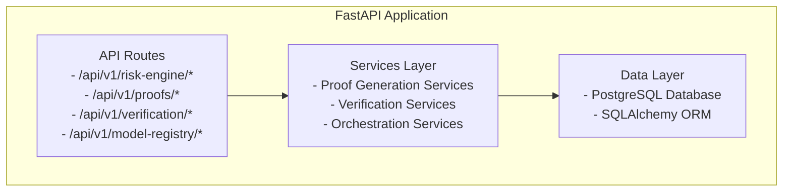

# Backend Services Architecture

This document details the backend service layer, including API structure, proof generation services, verification services, and database schema.

## Backend Architecture Overview

The backend is built with Python 3.11+ and FastAPI, providing RESTful APIs and orchestration services.



## API Structure

### Risk Engine API

**Base Path:** `/api/v1/risk-engine`

**Endpoints:**
- `POST /orchestrate-allocation` - Full allocation workflow
- `POST /execute-allocation` - Execute verified allocation
- `GET /decisions` - Get allocation history
- `GET /decision/{decision_id}` - Get specific decision

### Proof API

**Base Path:** `/api/v1/proofs`

**Endpoints:**
- `POST /generate` - Generate STARK proof
- `GET /{proof_job_id}` - Get proof status
- `POST /verify` - Verify proof locally

### Verification API

**Base Path:** `/api/v1/verification`

**Endpoints:**
- `GET /verification-status/{proof_job_id}` - Check verification status
- `GET /verify-fact-hash/{fact_hash}` - Verify fact hash on-chain

### Model Registry API

**Base Path:** `/api/v1/model-registry`

**Endpoints:**
- `GET /current` - Get current model
- `GET /history` - Get model history
- `GET /version/{version}` - Get specific version
- `POST /register` - Register new model (admin only)

## Proof Generation Services

### Stone Prover Service

**File:** `backend/app/services/stone_prover_service.py`

**Purpose:** Local STARK proof generation using Stone prover.

**Key Methods:**
- `generate_proof_sync(trace, memory, public_inputs) -> ProofResult`
- `calculate_fri_parameters(trace_size) -> FRIParams`
- `verify_proof_local(proof, public_inputs) -> bool`

**Features:**
- Dynamic FRI parameter calculation
- 2-4 second proof generation
- 100% success rate
- $0 cost (local execution)

### LuminAIR Service

**File:** `backend/app/services/luminair_service.py`

**Purpose:** Alternative prover using LuminAIR.

**Key Methods:**
- `generate_proof(metrics) -> ProofResult`
- `verify_proof(proof) -> bool`

**Features:**
- Rust-based prover
- Similar performance to Stone
- Fallback option

### Allocation Proof Orchestrator

**File:** `backend/app/services/allocation_proof_orchestrator.py`

**Purpose:** Routes between Stone and LuminAIR provers.

**Key Methods:**
- `generate_allocation_proof(metrics) -> ProofResult`
- `select_prover() -> ProverType`
- `handle_prover_failure() -> Fallback`

**Features:**
- Automatic prover selection
- Fallback mechanisms
- Cost optimization
- Error handling

## Verification Services

### Integrity Service

**File:** `backend/app/services/integrity_service.py`

**Purpose:** Herodotus Integrity integration for proof verification.

**Key Methods:**
- `verify_proof_full_and_register_fact(verifier_config, proof) -> bool`
- `get_verification_hash(proof_hash) -> str`
- `check_fact_registry(fact_hash) -> bool`

**Features:**
- Atlantic API integration
- Fact hash registration
- On-chain verification
- Status tracking

### Model Service

**File:** `backend/app/services/model_service.py`

**Purpose:** Model hash calculation and version management.

**Key Methods:**
- `calculate_model_hash(model_code) -> str`
- `get_model_hash_felt252(model_code) -> int`
- `get_current_model_version() -> dict`

**Features:**
- SHA-256 hash calculation
- Felt252 conversion
- Version tracking
- Model integrity verification

### Verification Service

**File:** `backend/app/services/verification_service.py`

**Purpose:** Proof verification status management.

**Key Methods:**
- `check_verification_status(proof_job_id) -> VerificationStatus`
- `verify_fact_hash_onchain(fact_hash) -> bool`
- `update_verification_status(proof_job_id, status) -> None`

## Orchestration Services

### Allocation Proposal Service

**File:** `backend/app/services/allocation_proposal_service.py`

**Purpose:** End-to-end allocation workflow orchestration.

**Key Methods:**
- `create_allocation_proposal(metrics) -> AllocationProposal`
- `generate_proof_for_proposal(proposal) -> ProofJob`
- `execute_allocation(proposal, proof_job) -> TransactionResult`

**Workflow:**
1. Fetch protocol metrics
2. Create allocation proposal
3. Generate STARK proof
4. Verify proof
5. Execute on-chain
6. Return results

### Protocol Metrics Service

**File:** `backend/app/services/protocol_metrics_service.py`

**Purpose:** Protocol data aggregation.

**Key Methods:**
- `get_jediswap_metrics() -> ProtocolMetrics`
- `get_ekubo_metrics() -> ProtocolMetrics`
- `calculate_utilization(pool_data) -> felt252`
- `calculate_volatility(price_history) -> felt252`

### Transaction Signing Service

**Purpose:** Automated transaction signing.

**Key Methods:**
- `sign_transaction(calldata) -> SignedTransaction`
- `submit_transaction(signed_tx) -> TransactionHash`
- `wait_for_confirmation(tx_hash) -> Confirmation`

**Security:**
- Encrypted private key storage
- Environment variable configuration
- No key exposure in logs

## Database Schema

### ProofJob Model

```python
class ProofJob(Base):
    id: str (Primary Key)
    status: ProofStatus (enum)
    proof_hash: str (nullable)
    fact_hash: str (nullable)
    l2_fact_hash: str (nullable)
    l2_verified_at: datetime (nullable)
    generated_at: datetime
    proof_size: int
    generation_time_ms: int
    source: str (Stone/LuminAIR)
```

### AllocationDecision Model

```python
class AllocationDecision(Base):
    id: str (Primary Key)
    decision_id: int
    jediswap_pct: int
    ekubo_pct: int
    jediswap_risk: int
    ekubo_risk: int
    transaction_hash: str
    block_number: int
    timestamp: datetime
    proof_job_id: str (Foreign Key)
```

## Service Dependencies

### External Dependencies

- **starknet.py:** Starknet Python SDK
- **SQLAlchemy:** Database ORM
- **Pydantic:** Data validation
- **FastAPI:** Web framework
- **PostgreSQL:** Database

### Internal Dependencies

- **Config Service:** Environment configuration
- **Database Service:** Connection management
- **RPC Service:** Starknet RPC client
- **Wallet Service:** Transaction signing

## Error Handling

### Proof Generation Errors

- **Prover Unavailable:** Fallback to alternative
- **Trace Generation Failed:** Retry with validation
- **FRI Parameter Error:** Auto-calculate parameters
- **Timeout:** Retry with longer timeout

### Verification Errors

- **Integrity Service Down:** Queue for retry
- **Fact Registry Error:** Log and retry
- **Network Error:** Automatic retry with backoff

### Transaction Errors

- **RPC Error:** Failover to backup RPC
- **Transaction Revert:** Log error and return
- **Gas Estimation Failed:** Use default gas

## Performance Optimization

### Caching

- **Protocol Metrics:** Cache for 60 seconds
- **Model Hashes:** Cache until model changes
- **Fact Registry Queries:** Cache verification status

### Async Operations

- **Proof Generation:** Async with timeout
- **Verification:** Async with retry
- **Transaction Submission:** Async with confirmation

### Database Optimization

- **Indexes:** On proof_job_id, transaction_hash
- **Connection Pooling:** SQLAlchemy pool
- **Query Optimization:** Eager loading for relationships

## Next Steps

- **[Proof Generation](04-proof-generation.md)** - Detailed proof pipeline
- **[On-Chain Verification](05-on-chain-verification.md)** - Verification architecture
- **[Data Flow](06-data-flow.md)** - End-to-end data flow

---

**Backend Summary:** FastAPI-based service layer providing proof generation, verification, and orchestration services with PostgreSQL data persistence.
