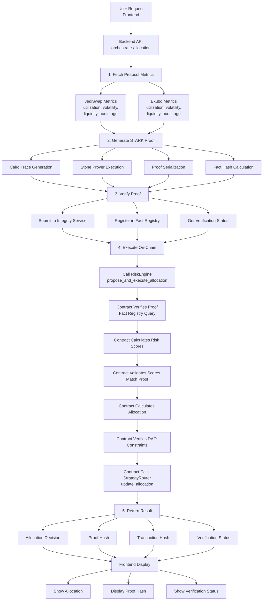
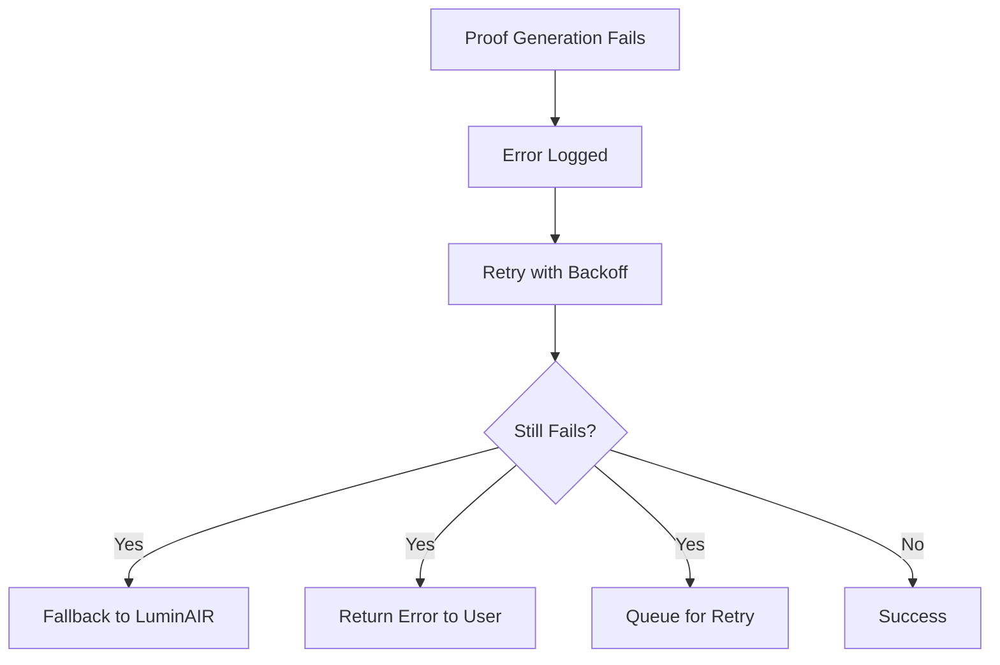
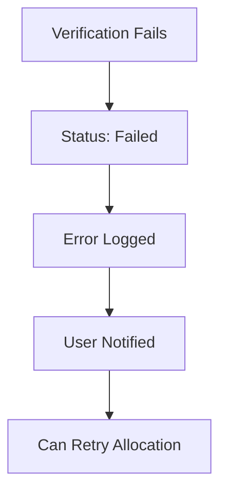
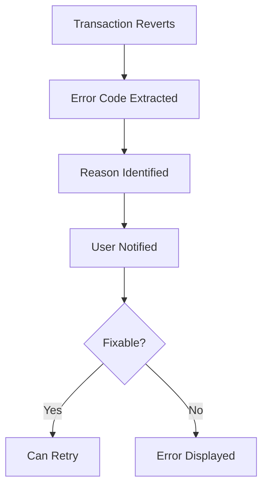
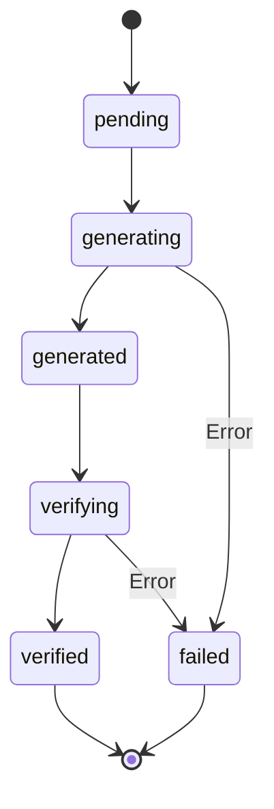
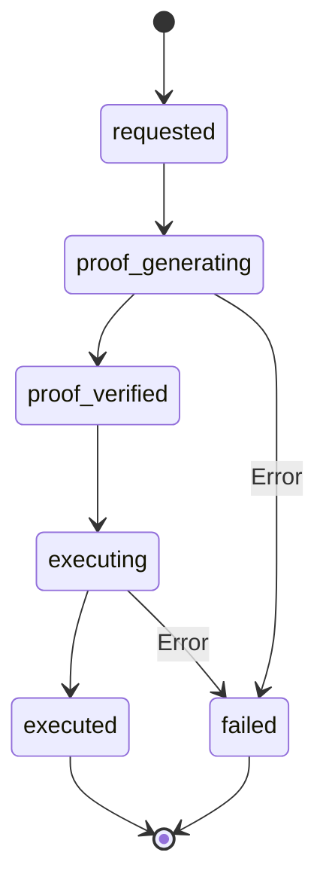

# Data Flow

This document details the end-to-end data flow, request-to-execution flow, event emission, state management, and error handling flows.

## End-to-End Data Flow Diagram



## Request → Proof → Verify → Execute Flow

### Phase 1: Request

**Frontend:**
```typescript
// User clicks "Orchestrate Allocation"
const response = await fetch('/api/v1/risk-engine/orchestrate-allocation', {
  method: 'POST',
  body: JSON.stringify({})
});
```

**Backend:**
```python
# Receive request
@app.post("/api/v1/risk-engine/orchestrate-allocation")
async def orchestrate_allocation(request: OrchestrationRequest):
    # Process request
```

### Phase 2: Proof Generation

**Metrics Collection:**
```python
jediswap_metrics = await get_jediswap_metrics()
ekubo_metrics = await get_ekubo_metrics()
```

**Trace Generation:**
```python
trace = generate_cairo_trace(metrics)
memory = extract_memory(trace)
public_inputs = extract_public_inputs(trace)
```

**Proof Generation:**
```python
proof = stone_prover.generate_proof_sync(
    trace=trace,
    memory=memory,
    public_inputs=public_inputs
)
fact_hash = calculate_fact_hash(proof)
```

### Phase 3: Verification

**Integrity Service:**
```python
integrity = IntegrityService(rpc_url, network="sepolia")
verified = await integrity.verify_proof_full_and_register_fact(
    verifier_config=proof.verifier_config,
    stark_proof=proof.proof_json
)
```

**Fact Registry:**
```python
# Fact hash registered in contract
fact_hash = integrity.get_verification_hash(proof_hash)
# Status: verified
```

### Phase 4: Execution

**Transaction Preparation:**
```python
calldata = [
    # Metrics
    jediswap_metrics.utilization,
    jediswap_metrics.volatility,
    # ... more metrics
    # Proof parameters
    jediswap_proof_fact,
    ekubo_proof_fact,
    expected_jediswap_score,
    expected_ekubo_score,
    fact_registry_address
]
```

**Contract Execution:**
```cairo
// RiskEngine.propose_and_execute_allocation()
// STEP 0: Verify proofs
let proofs_valid = verify_allocation_decision_with_proofs(...);
assert(proofs_valid, 0);

// STEP 1: Calculate risk scores
let jediswap_risk = calculate_risk_score(...);
let ekubo_risk = calculate_risk_score(...);

// STEP 2: Validate scores match proof
assert(jediswap_risk == expected_jediswap_score, 1);
assert(ekubo_risk == expected_ekubo_score, 2);

// STEP 3: Calculate allocation
let (jediswap_pct, ekubo_pct) = calculate_allocation(...);

// STEP 4: Verify constraints
let constraints_valid = verify_constraints(...);
assert(constraints_valid, 3);

// STEP 5: Execute
strategy_router.update_allocation(jediswap_pct, ekubo_pct);
```

## Event Emission and Indexing

### Events Emitted

**AllocationProposed:**
```cairo
event AllocationProposed {
    decision_id: felt252,
    jediswap_pct: felt252,
    ekubo_pct: felt252,
    proof_fact_hash: felt252
}
```

**AllocationExecuted:**
```cairo
event AllocationExecuted {
    decision_id: felt252,
    transaction_hash: felt252,
    model_hash: felt252
}
```

**ConstraintsValidated:**
```cairo
event ConstraintsValidated {
    decision_id: felt252,
    constraints: DAOConstraints
}
```

### Event Indexing

**Backend:**
- Listen for events via RPC
- Index events in database
- Update UI in real-time
- Maintain audit trail

**Frontend:**
- Poll for new events
- Display in dashboard
- Update allocation display
- Show transaction history

## State Management

### Contract State

**RiskEngine:**
- `decision_count`: Total decisions
- `current_decision`: Latest allocation
- `current_model_hash`: Active model
- `strategy_router`: Router address

**StrategyRouter:**
- `total_deposited`: Total funds
- `jediswap_pct`: Current allocation
- `ekubo_pct`: Current allocation
- `user_balances`: Per-user balances

**ModelRegistry:**
- `current_version`: Active version
- `model_versions`: Version map
- `version_count`: Total versions

### Backend State

**Database:**
- `ProofJob`: Proof tracking
- `AllocationDecision`: Decision history
- `PerformanceSnapshot`: Performance data

**Cache:**
- Protocol metrics (60s TTL)
- Model hashes (until change)
- Fact Registry status (30s TTL)

## Error Handling Flows

### Proof Generation Failure



### Verification Failure



### Transaction Revert



### Common Error Codes

**0:** Proofs not verified
**1:** JediSwap risk score mismatch
**2:** Ekubo risk score mismatch
**3:** Constraints violated
**4:** Insufficient balance

## Data Transformation

### Input → Output Flow

**Input:**
- Protocol metrics (raw data)
- User request (allocation trigger)

**Processing:**
- Risk calculation (deterministic)
- Proof generation (cryptographic)
- Verification (on-chain)

**Output:**
- Allocation decision
- Proof hash
- Transaction hash
- Verification status

### State Transitions

**ProofJob Status:**


**Allocation Status:**


## Performance Considerations

### Timing

- **Metrics Fetch:** <1 second
- **Proof Generation:** 2-4 seconds
- **Verification:** 1-2 seconds
- **Transaction:** 5-10 seconds
- **Confirmation:** 12+ seconds
- **Total:** ~20-30 seconds

### Optimization

- **Parallel Processing:** Metrics and proof generation
- **Caching:** Protocol metrics, model hashes
- **Async Operations:** Non-blocking verification
- **Batch Operations:** Multiple proofs

## Next Steps

- **[System Overview](01-system-overview.md)** - Component architecture
- **[Smart Contracts](02-smart-contracts.md)** - Contract details
- **[Backend Services](03-backend-services.md)** - Service layer

---

**Data Flow Summary:** Complete end-to-end flow from user request through proof generation, verification, and on-chain execution, with comprehensive error handling and state management.
