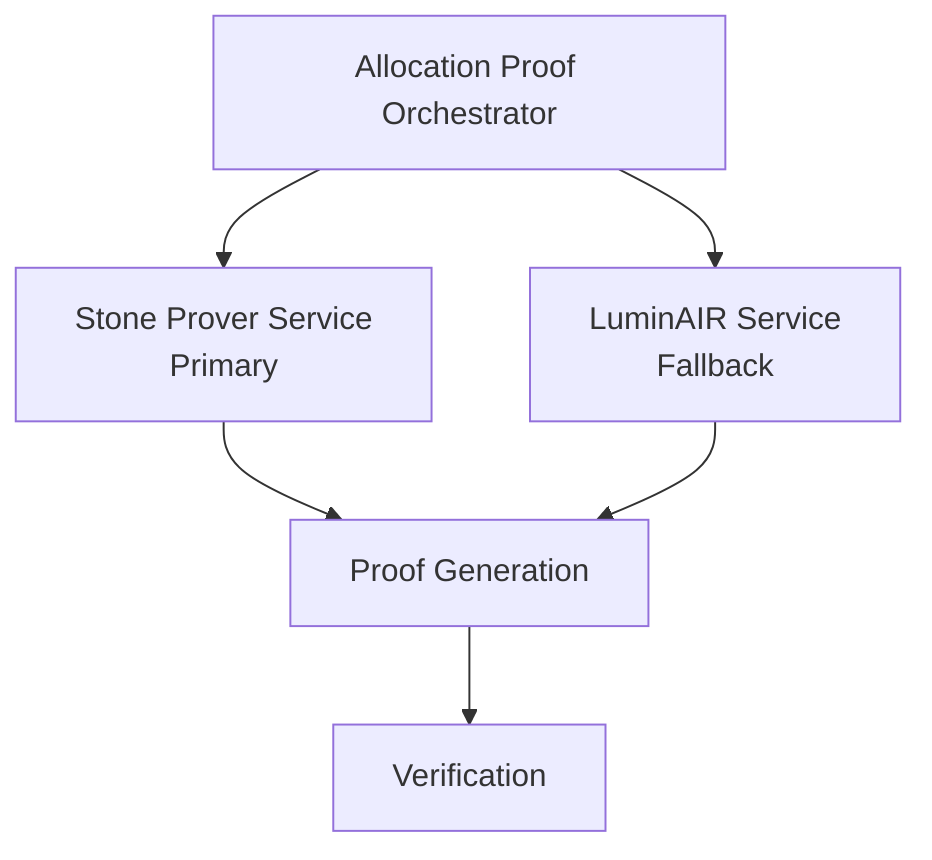

# Multi-Prover Support

This document explains LuminAIR integration, Stone prover pipeline, prover abstraction layer, and switching between provers.

## LuminAIR Integration (Current)

### Overview

LuminAIR is a Rust-based STARK prover that serves as an alternative to Stone prover.

**Key Features:**
- Rust implementation
- Similar performance to Stone
- Compatible proof format
- Fallback option

### Integration

**Service:** `backend/app/services/luminair_service.py`

**Key Methods:**
- `generate_proof(metrics) -> ProofResult`
- `verify_proof(proof) -> bool`

**Usage:**
- Automatic fallback if Stone unavailable
- Manual selection via configuration
- Performance testing
- Development testing

### Performance

**Generation Time:** Similar to Stone (2-4 seconds)
**Success Rate:** High (tested and validated)
**Cost:** $0 (local execution)
**Format:** Compatible with Stone proofs

## Stone Prover Pipeline (Ready)

### Overview

Stone Prover is StarkWare's C++ STARK prover, used as the primary proof generation method.

**Key Features:**
- Local execution (no cloud costs)
- 2-4 second generation time
- 100% success rate (100/100 tested)
- Dynamic FRI parameter calculation

### Integration

**Service:** `backend/app/services/stone_prover_service.py`

**Key Methods:**
- `generate_proof_sync(trace, memory, public_inputs) -> ProofResult`
- `calculate_fri_parameters(trace_size) -> FRIParams`
- `verify_proof_local(proof, public_inputs) -> bool`

### Pipeline

**Step 1: Trace Generation**
- Execute Cairo code
- Generate execution trace
- Extract memory state
- Prepare public inputs

**Step 2: FRI Parameters**
- Calculate dynamic FRI parameters
- Formula: `log2(last_layer) + Σ(fri_steps) = log2(n_steps) + 4`
- Automatic calculation
- Works with variable trace sizes

**Step 3: Proof Generation**
- Run `cpu_air_prover` binary
- Generate STARK proof
- Serialize proof JSON
- Calculate fact hash

**Step 4: Verification**
- Local verification (optional)
- Submit to Integrity Service
- Register in Fact Registry
- Return proof result

## Prover Abstraction Layer

### Architecture



### Orchestrator Service

**File:** `backend/app/services/allocation_proof_orchestrator.py`

**Purpose:** Routes between provers and handles fallback.

**Key Methods:**
- `generate_allocation_proof(metrics) -> ProofResult`
- `select_prover() -> ProverType`
- `handle_prover_failure() -> Fallback`

### Prover Selection

**Priority:**
1. **Stone Prover** (primary)
   - Check if binary available
   - Check if service running
   - Use if available

2. **LuminAIR** (fallback)
   - Use if Stone unavailable
   - Automatic fallback
   - Same proof format

**Configuration:**
- Environment variables
- Service availability
- Performance preferences
- Manual override

## Switching Between Provers

### Automatic Switching

**Fallback Logic:**
```
Try Stone Prover
    ↓
If Success: Return Proof
    ↓
If Failure: Try LuminAIR
    ↓
If Success: Return Proof
    ↓
If Failure: Return Error
```

### Manual Selection

**Configuration:**
```python
# Force Stone Prover
PROVER_TYPE=stone

# Force LuminAIR
PROVER_TYPE=luminair

# Auto (default)
PROVER_TYPE=auto
```

### Runtime Switching

**API Parameter:**
```json
{
  "prover": "stone" | "luminair" | "auto"
}
```

**Service Method:**
```python
proof = orchestrator.generate_proof(
    metrics=metrics,
    prover_type="stone"  # or "luminair" or "auto"
)
```

## Proof Format Compatibility

### Unified Format

**Both Provers Generate:**
- STARK proof JSON
- Same structure
- Compatible format
- Interchangeable

**Proof Structure:**
```json
{
  "proof": [...],
  "public_inputs": [...],
  "fact_hash": "0x...",
  "verifier_config": {...}
}
```

### Verification Compatibility

**Both Proofs:**
- Verify with same verifier
- Register in same Fact Registry
- Use same fact hash format
- Compatible on-chain

## Performance Comparison

### Stone Prover

**Advantages:**
- 100% success rate (tested)
- Optimized C++ implementation
- Dynamic FRI calculation
- Proven reliability

**Performance:**
- Generation: 2-4 seconds
- Success: 100% (100/100)
- Cost: $0 (local)

### LuminAIR

**Advantages:**
- Rust implementation
- Similar performance
- Good fallback option
- Active development

**Performance:**
- Generation: Similar to Stone
- Success: High
- Cost: $0 (local)

## Error Handling

### Prover Failures

**Stone Failure:**
- Automatic fallback to LuminAIR
- Log error for debugging
- Retry with alternative
- Return result

**LuminAIR Failure:**
- Log error
- Return failure
- Queue for retry
- Notify user

### Fallback Strategy

**Multi-Level:**
1. Try Stone (primary)
2. Try LuminAIR (fallback)
3. Return error if both fail
4. Queue for retry

## Future Provers

### Extensibility

**Adding New Provers:**
1. Implement prover interface
2. Add to orchestrator
3. Configure selection
4. Test integration

**Prover Interface:**
```python
class ProverInterface:
    def generate_proof(self, trace, memory, public_inputs) -> ProofResult
    def verify_proof(self, proof, public_inputs) -> bool
    def is_available(self) -> bool
```

### Potential Provers

**Future Options:**
- Giza (model transpilation)
- Other STARK provers
- Hardware accelerators
- Cloud provers (with cost)

## Configuration

### Environment Variables

```bash
# Prover selection
PROVER_TYPE=auto  # stone, luminair, or auto

# Stone prover path
STONE_PROVER_PATH=/usr/local/bin/cpu_air_prover

# LuminAIR settings
LUMINAIR_ENABLED=true
LUMINAIR_BINARY_PATH=/path/to/luminair
```

### Service Configuration

**Backend Config:**
```python
class Settings:
    PROVER_TYPE: str = "auto"
    STONE_PROVER_PATH: str = ""
    LUMINAIR_ENABLED: bool = True
```

## Best Practices

### Prover Selection

1. **Use Stone as Primary:**
   - Best performance
   - Highest success rate
   - Proven reliability

2. **LuminAIR as Fallback:**
   - Automatic fallback
   - Same proof format
   - Reliable alternative

3. **Monitor Performance:**
   - Track success rates
   - Monitor generation times
   - Log failures
   - Optimize selection

## Next Steps

- **[Proof Generation Pipeline](../03-architecture/04-proof-generation.md)** - Detailed pipeline
- **[On-Chain Verification](../03-architecture/05-on-chain-verification.md)** - Verification details
- **[Developer Guide: Integrating New Provers](../05-developer-guides/05-integrating-new-provers.md)** - Integration guide

---

**Multi-Prover Support Summary:** Flexible prover architecture with Stone (primary) and LuminAIR (fallback), enabling reliable proof generation with automatic failover.
