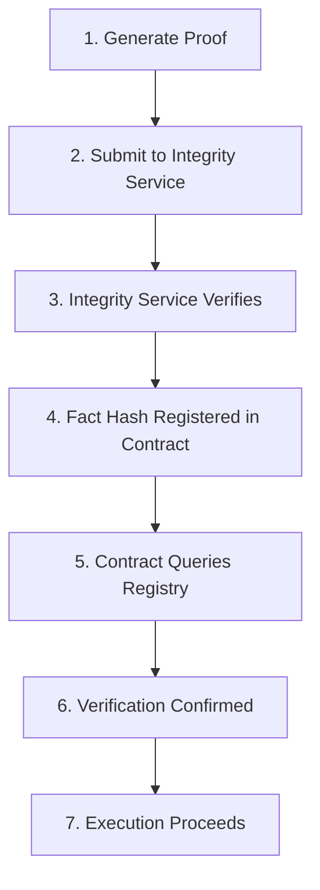

# Fact Registry Contract Reference

Complete reference for the SHARP Fact Registry contract, including custom FactRegistry deployment, verification queries, and integration patterns.

## SHARP Fact Registry

### Public Fact Registry

**Sepolia Testnet:**
```
0x063feefb4b7cfb46b89d589a8b00bceb7905a7d51c4e8068d4b45e0d9d018f64
```

**Explorer:**
- Starkscan: https://sepolia.starkscan.co/contract/0x063feefb4b7cfb46b89d589a8b00bceb7905a7d51c4e8068d4b45e0d9d018f64

**Purpose:** Public SHARP Fact Registry for verified computation facts.

## Interface Definition

```cairo
#[starknet::interface]
trait IFactRegistry<TContractState> {
    fn get_all_verifications_for_fact_hash(
        self: @TContractState,
        fact_hash: felt252
    ) -> Span<felt252>;
}
```

## Key Functions

### get_all_verifications_for_fact_hash

Queries the Fact Registry for a specific fact hash.

**Parameters:**
- `fact_hash`: Fact hash (felt252)

**Returns:**
- `Span<felt252>`: Array of verifications (non-empty if verified)

**Verification Logic:**
- Empty array = not verified
- Non-empty array = verified
- Array length = number of verifications

## Custom FactRegistry Deployment

### Why Deploy Your Own?

**Benefits:**
- Full control over verification
- Custom verification logic
- Independent from public registry
- Testing and development

**Trade-offs:**
- Deployment costs
- Maintenance responsibility
- Less standard

### Deployment Process

**1. Build FactRegistry:**
```bash
cd integrity
scarb build
```

**2. Declare Contract:**
```bash
sncast declare \
  --contract-name FactRegistry \
  --network sepolia
```

**3. Deploy Contract:**
```bash
sncast deploy \
  --class-hash <class_hash> \
  --network sepolia
```

**4. Update Configuration:**
- Update `RISK_ENGINE_ADDRESS` in backend config
- Update `FACT_REGISTRY_ADDRESS` in contracts
- Redeploy RiskEngine if needed

## Verification Queries

### On-Chain Query

**In RiskEngine:**
```cairo
let registry = IFactRegistryDispatcher {
    contract_address: fact_registry_address
};

let verifications = registry.get_all_verifications_for_fact_hash(proof_fact);
let len = verifications.len();

if len == 0 {
    return false; // Not verified
}
// Verified if array is non-empty
```

### Off-Chain Query

**Using starknet.py:**
```python
from starknet_py.contract import Contract

contract = await Contract.from_address(
    address=fact_registry_address,
    provider=provider
)

verifications = await contract.functions["get_all_verifications_for_fact_hash"].call(
    fact_hash=fact_hash
)

is_verified = len(verifications) > 0
```

## Integration Patterns

### RiskEngine Integration

**Pattern:**
1. RiskEngine receives fact hash
2. Queries Fact Registry
3. Verifies array is non-empty
4. Proceeds if verified

**Code:**
```cairo
let proofs_valid = verify_allocation_decision_with_proofs(
    jediswap_metrics,
    ekubo_metrics,
    jediswap_proof_fact,
    ekubo_proof_fact,
    expected_jediswap_score,
    expected_ekubo_score,
    fact_registry_address
);

assert(proofs_valid, 0);
```

### Backend Integration

**Pattern:**
1. Generate proof
2. Submit to Integrity Service
3. Integrity Service registers in Fact Registry
4. Get fact hash
5. Pass to contract

**Code:**
```python
integrity = IntegrityService(rpc_url, network="sepolia")
verified = await integrity.verify_proof_full_and_register_fact(
    verifier_config=proof.verifier_config,
    stark_proof=proof.proof_json
)

fact_hash = integrity.get_verification_hash(proof_hash)
```

## Fact Hash Format

### Format

**Type:** felt252
**Source:** Pedersen hash of public inputs
**Usage:** Registry lookup key
**Permanent:** Immutable once registered

### Calculation

**Process:**
1. Extract public inputs from proof
2. Calculate Pedersen hash
3. Format as felt252
4. Use as registry key

## Verification Workflow

### Complete Flow



## Error Handling

### Verification Failures

**Not Verified:**
- Fact hash not in registry
- Empty verification array
- Contract reverts

**Handling:**
- Check proof generation
- Verify Integrity Service
- Confirm registration
- Retry if needed

## Next Steps

- **[RiskEngine](01-risk-engine.md)** - Core contract
- **[On-Chain Verification](../03-architecture/05-on-chain-verification.md)** - Verification architecture
- **[Deployment: Fact Registry](../08-deployment/04-fact-registry.md)** - Deployment guide

---

**Fact Registry Summary:** On-chain proof verification registry enabling trustless verification of STARK proofs with public or custom deployments.
