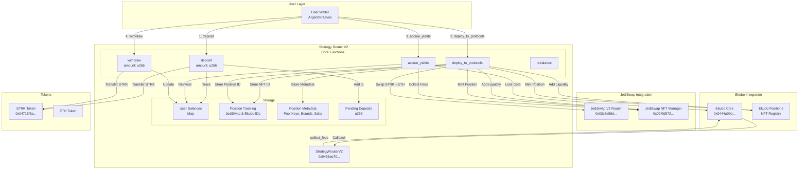
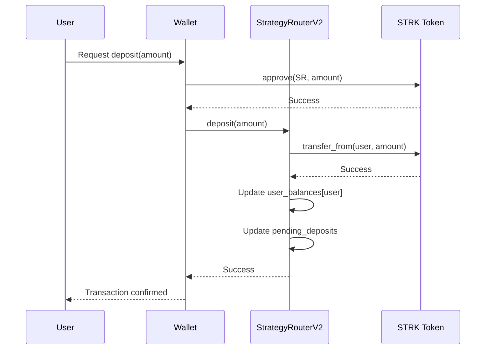
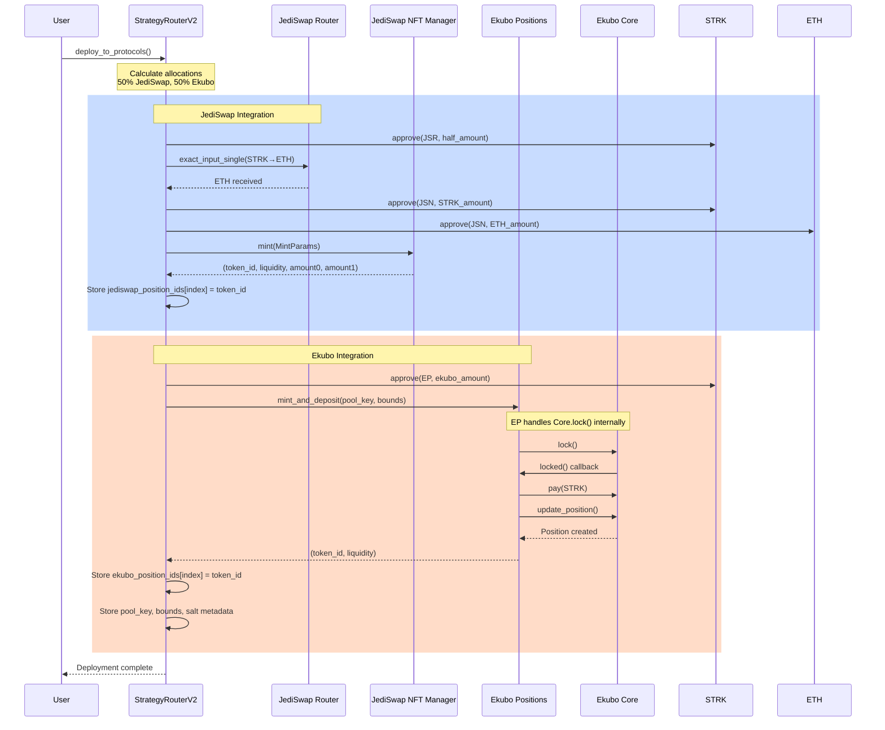
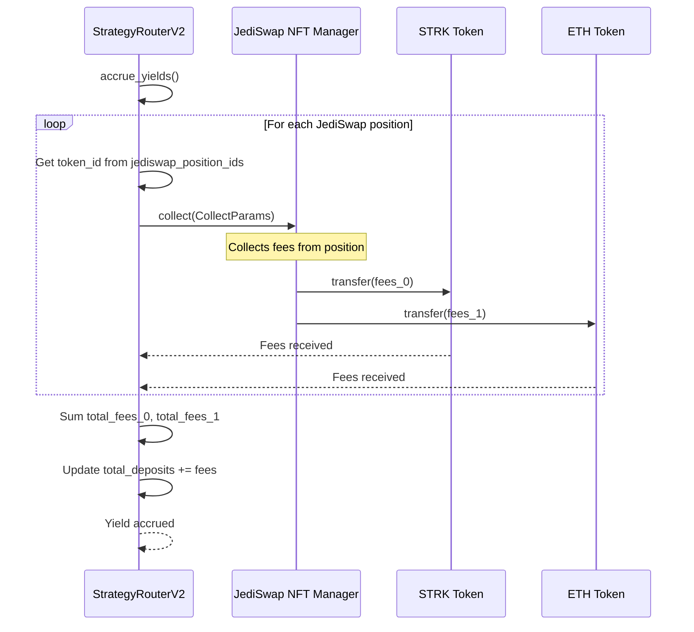
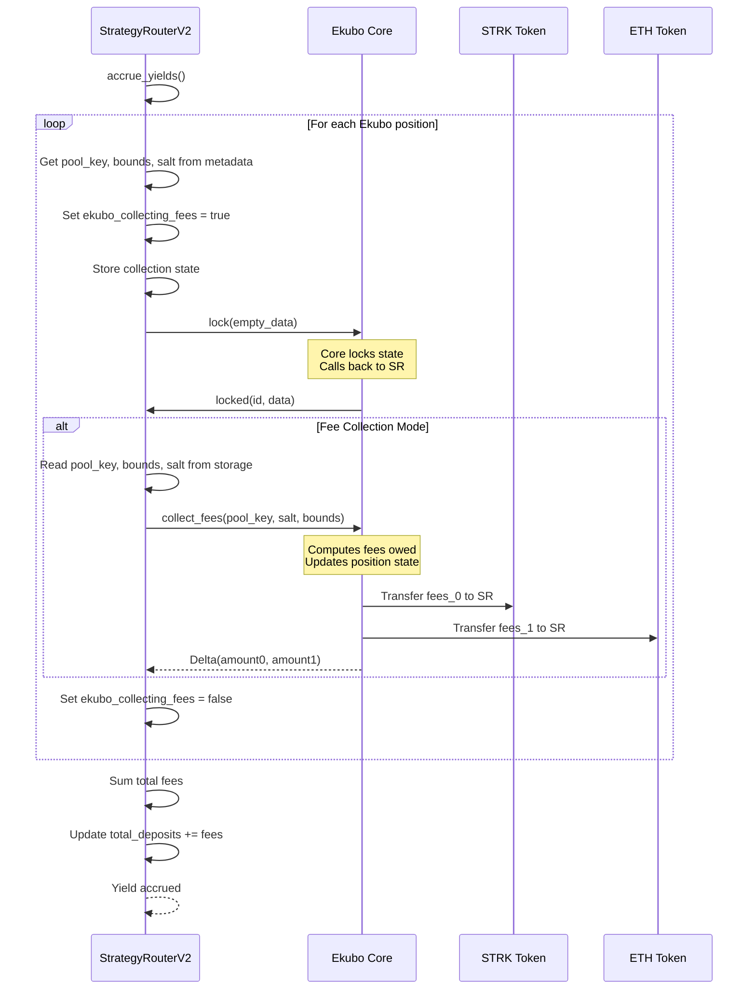
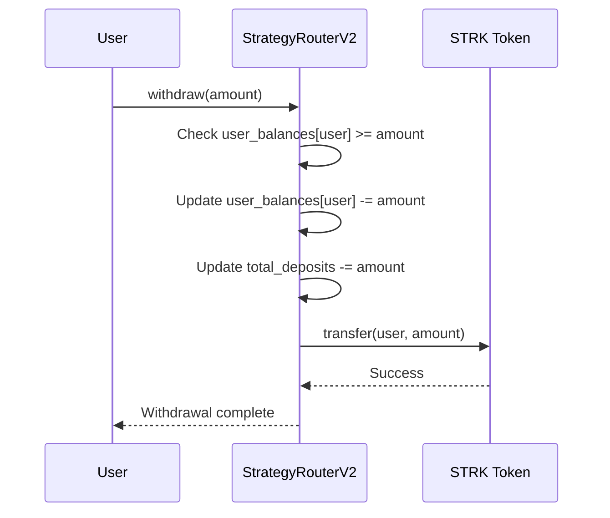

# Strategy Router V2 - Protocol Flow Diagram

## Contract Architecture



## User Deposit Flow



## Protocol Deployment Flow



## Fee Collection Flow

### JediSwap Fee Collection



### Ekubo Fee Collection



## Withdrawal Flow



## Contract Function Reference

### StrategyRouterV2 Core Functions

| Function | Purpose | Parameters | Returns |
|----------|---------|------------|---------|
| `deposit` | User deposits STRK | `amount: u256` | - |
| `withdraw` | User withdraws STRK | `amount: u256` | `u256` (actual withdrawn) |
| `deploy_to_protocols` | Deploy pending deposits to protocols | - | - |
| `accrue_yields` | Collect fees from all positions | - | `u256` (total yield) |
| `rebalance` | Rebalance positions based on allocation | - | - |
| `update_allocation` | Update protocol allocation percentages | `jediswap_pct: felt252`, `ekubo_pct: felt252` | - |

### Position Tracking Functions

| Function | Purpose | Parameters | Returns |
|----------|---------|------------|---------|
| `get_jediswap_position` | Get JediSwap NFT token ID | `index: u256` | `u256` (token_id) |
| `get_ekubo_position` | Get Ekubo position ID | `index: u256` | `u64` (token_id) |
| `get_jediswap_position_count` | Get total JediSwap positions | - | `u256` |
| `get_ekubo_position_count` | Get total Ekubo positions | - | `u256` |

### Testing Functions

| Function | Purpose | Parameters |
|----------|---------|------------|
| `test_jediswap_only` | Test JediSwap integration only | `amount: u256` |
| `test_ekubo_only` | Test Ekubo integration only | `amount: u256` |
| `approve_token_for_testing` | Approve tokens for testing | `token: ContractAddress`, `spender: ContractAddress`, `amount: u256` |

## Storage Structure

### User Balances
```cairo
user_balances: Map<ContractAddress, u256>
```

### Position Tracking
```cairo
// JediSwap
jediswap_position_count: u256
jediswap_position_ids: Map<u256, u256>  // index -> NFT token_id

// Ekubo
ekubo_position_count: u256
ekubo_position_ids: Map<u256, u64>  // index -> position token_id
ekubo_position_token0: Map<u256, ContractAddress>
ekubo_position_token1: Map<u256, ContractAddress>
ekubo_position_fee: Map<u256, u128>
ekubo_position_tick_spacing: Map<u256, u128>
ekubo_position_extension: Map<u256, ContractAddress>
ekubo_position_salt: Map<u256, felt252>  // For collect_fees()
ekubo_position_tick_lower_mag: Map<u256, u128>
ekubo_position_tick_lower_sign: Map<u256, bool>
ekubo_position_tick_upper_mag: Map<u256, u128>
ekubo_position_tick_upper_sign: Map<u256, bool>
```

### Protocol Configuration
```cairo
jediswap_allocation: u256  // Basis points (10000 = 100%)
ekubo_allocation: u256     // Basis points (10000 = 100%)
jediswap_router: ContractAddress
jediswap_nft_manager: ContractAddress
ekubo_core: ContractAddress
ekubo_positions: ContractAddress
```

## Integration Details

### JediSwap Integration
- **Router**: V2 Swap Router (`exact_input_single`)
- **Liquidity**: NFT Position Manager (`mint`)
- **Fee Collection**: NFT Position Manager (`collect`)
- **Position Type**: ERC-721 NFT (token_id)

### Ekubo Integration
- **Liquidity**: Positions Contract (`mint_and_deposit`)
- **Fee Collection**: Core Contract (`collect_fees` via lock/callback)
- **Position Type**: Position ID (u64) + metadata (pool_key, bounds, salt)
- **Lock Pattern**: Core.lock() → locked() callback → collect_fees()

## Current Deployment

**Contract Address**: `0x0456ae70b7b9c77522b4bef65a119ce4e8341be78c4007ceefd764685e7aad8e`  
**Network**: Starknet Sepolia  
**Class Hash**: `0x01afb6e5a5811eca06eddb043710aff0b2527055703d80d41f18325e40b332d8`

**Explorer**: https://sepolia.starkscan.co/contract/0x0456ae70b7b9c77522b4bef65a119ce4e8341be78c4007ceefd764685e7aad8e

