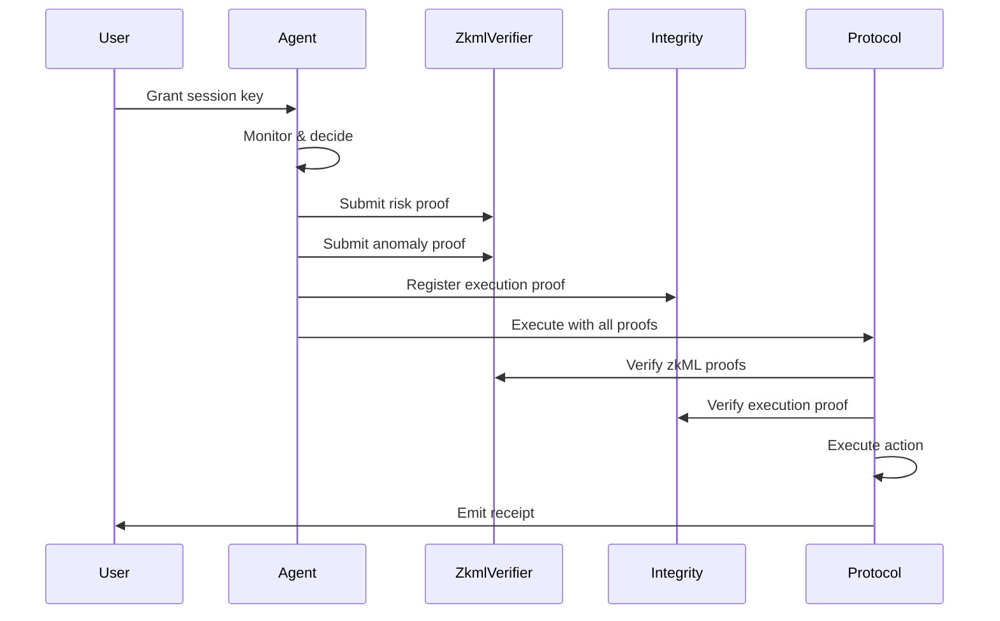

# GATE-1: Governed Autonomous Trustless Execution

**Version:** 1.0.0  
**Status:** Draft  
**Author:** Obsqra Labs  
**Created:** 2026-02-02

## zkDE + GATE

**zkDE | Zero-Knowledge Deterministic Engine** — the infrastructure where execution is proof-gated and verification is deterministic. **GATE | Governed Autonomous Trustless Execution** — the standard that defines how agents operate in that engine.

GATE-1 is the **standard** for the zkDE engine: interfaces, proof formats, session key structures, intent commitments, and verification flows.

---

## Abstract

GATE-1 defines a standard interface for privacy-preserving autonomous agents on Starknet under the zkDE framework. It specifies proof formats, session key structures, intent commitments, and verification flows for agents that execute on behalf of users while maintaining privacy.

The name GATE reflects the core primitive: execution is *gated* by proof — no proof, no execution.

## Motivation

DeFi agents need:
1. **Delegation** — Users grant limited permissions
2. **Verification** — Actions must be provably correct
3. **Privacy** — Intent and strategy stay hidden
4. **Safety** — Malicious actions are prevented

Current approaches lack standardization. GATE-1 provides a common interface for zkDE-compatible agents and interoperability between agents, protocols, and verification systems.

## Specification

### 1. Session Key Format

```cairo
struct SessionKey {
    session_key: ContractAddress,
    owner: ContractAddress,
    max_position: u256,
    allowed_protocols: u8,
    expiry: u64,
    is_active: bool,
    created_at: u64,
}
```

**Protocol Bitmap:**
- Bit 0 (1): Protocol 0 allowed
- Bit 1 (2): Protocol 1 allowed
- Bit 2 (4): Protocol 2 allowed

### 2. Intent Commitment Format

```cairo
struct IntentCommitment {
    user: ContractAddress,
    commitment: felt252,
    chain_id: felt252,
    block_number: u64,
    timestamp: u64,
    used: bool,
    action_hash: felt252,
}
```

**Commitment Calculation:**
```
commitment = poseidon_hash([intent_data, nonce, chain_id, block_number])
```

### 3. Proof Interfaces

#### 3.1 zkML Proof (Garaga/Groth16)

```cairo
trait IZkmlVerifier {
    fn verify_risk_score_proof(
        proof_calldata: Span<felt252>,
        commitment_hash: felt252
    ) -> bool;
    
    fn verify_anomaly_proof(
        proof_calldata: Span<felt252>,
        pool_id: felt252,
        commitment_hash: felt252
    ) -> bool;
    
    fn verify_combined_proofs(
        risk_proof_calldata: Span<felt252>,
        anomaly_proof_calldata: Span<felt252>,
        pool_id: felt252,
        commitment_hash: felt252
    ) -> bool;
}
```

**Proof Calldata Format (Groth16/BN254):**
```
[pi_a[0], pi_a[1], pi_b[0][0], pi_b[0][1], pi_b[1][0], pi_b[1][1], pi_c[0], pi_c[1], ...public_signals]
```

#### 3.2 Execution Proof (Integrity/STARK)

```cairo
trait IFactRegistry {
    fn is_valid(fact_hash: felt252) -> bool;
}
```

### 4. Constraint Receipt Format

```cairo
struct ConstraintReceipt {
    user: ContractAddress,
    constraints_hash: felt252,
    proof_hash: felt252,
    action_type: felt252,
    protocol_id: u8,
    amount: u256,
    timestamp: u64,
    receipt_id: felt252,
}
```

### 5. Compliance Profile Format

```cairo
struct ComplianceProfile {
    user: ContractAddress,
    profile_type: felt252,
    statement_hash: felt252,
    proof_hash: felt252,
    threshold: u256,
    result: felt252,
    timestamp: u64,
    expiry: u64,
    is_active: bool,
}
```

### 6. Agent Execution Interface

```cairo
trait IGateAgent {
    fn execute_with_proofs(
        receipt_commitment: felt252,
        intent_hash: felt252,
        zkml_proof_calldata: Span<felt252>,
        execution_proof_hash: felt252,
        action_calldata: Span<felt252>
    );
    
    fn execute_with_session(
        session_id: felt252,
        proof_hash: felt252,
        action_calldata: Span<felt252>
    );
    
    fn get_position(user: ContractAddress, protocol_id: u8) -> u256;
    fn get_constraints(user: ContractAddress) -> (u256, u256, u64);
}
```

### 7. Verification Flow



### 8. Error Codes

| Code | Name | Description |
|------|------|-------------|
| `GATE_INVALID_SESSION` | Session invalid | Session expired, revoked, or non-existent |
| `GATE_INVALID_PROOF` | Proof invalid | Proof verification failed |
| `GATE_REPLAY_DETECTED` | Replay attack | Intent commitment already used |
| `GATE_CHAIN_MISMATCH` | Wrong chain | Intent for different chain |
| `GATE_BLOCK_EXPIRED` | Block too old | Intent commitment outside valid window |
| `GATE_RISK_TOO_HIGH` | Risk check failed | Risk score above threshold |
| `GATE_ANOMALY_DETECTED` | Anomaly found | Pool/protocol flagged as unsafe |
| `GATE_POSITION_EXCEEDED` | Position limit | Amount exceeds max_position |
| `GATE_PROTOCOL_BLOCKED` | Protocol blocked | Protocol not in allowed list |

### 9. Events

```cairo
#[event]
struct GateExecuted {
    user: ContractAddress,
    agent: ContractAddress,
    session_id: felt252,
    action_type: felt252,
    amount: u256,
    zkml_proof_hash: felt252,
    execution_proof_hash: felt252,
    receipt_id: felt252,
    timestamp: u64,
}

#[event]
struct GateSessionGranted {
    owner: ContractAddress,
    session_key: ContractAddress,
    session_id: felt252,
    max_position: u256,
    allowed_protocols: u8,
    expiry: u64,
}

#[event]
struct GateIntentUsed {
    commitment: felt252,
    action_hash: felt252,
    timestamp: u64,
}
```

## Rationale

### Why Hybrid Proof System?

- **Garaga (SNARK)** for zkML: Hides model outputs, compact proofs
- **Integrity (STARK)** for execution: Native Starknet, no trusted setup

### Why Intent Commitments?

- Prevents replay attacks
- Enables fork-safety
- Binds proof to specific execution window

### Why Session Keys?

- Starknet-native account abstraction
- Limits exposure if compromised
- Enables autonomous execution within bounds

## Security Considerations

1. **Trusted Setup:** zkML circuits require trusted setup. Use existing powers of tau.
2. **Session Key Storage:** Secure session keys as carefully as account keys.
3. **Proof Freshness:** Use short block windows for intent commitments.
4. **Model Updates:** Changing zkML models requires new trusted setup.

## Reference Implementation

See [github.com/obsqra-labs/zkdefi](https://github.com/obsqra-labs/zkdefi):

- `contracts/src/proof_gated_yield_agent.cairo`
- `contracts/src/zkml_verifier.cairo`
- `contracts/src/session_key_manager.cairo`
- `contracts/src/intent_commitment.cairo`
- `backend/app/services/agent_rebalancer.py`

## Copyright

Copyright 2026 Obsqra Labs. Licensed under Apache-2.0.
