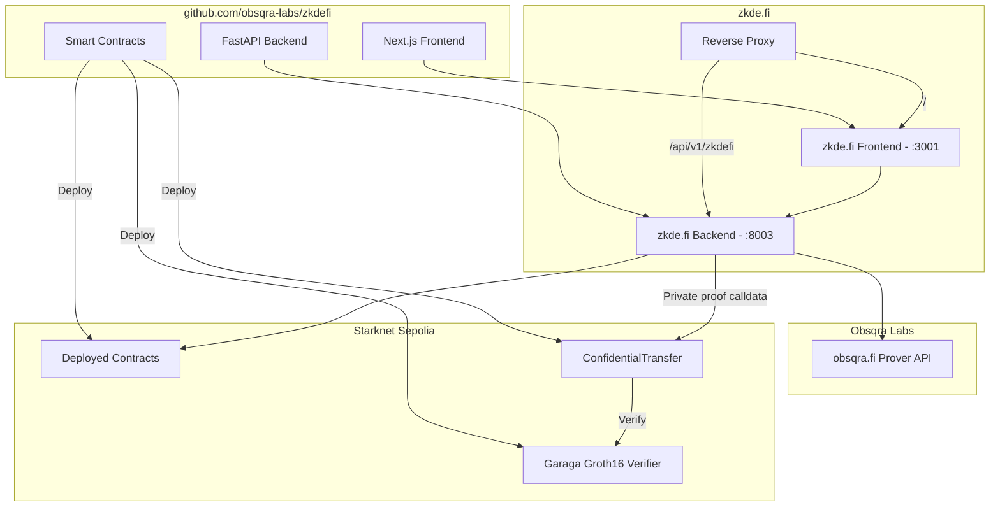

# zkde.fi Architecture

## Overview

**zkde.fi** (by Obsqra Labs) is an open-source privacy-preserving autonomous agent for DeFi on Starknet. It provides proof-gated execution, zkML-gated rebalancing, confidential transfers, and selective disclosure.

## Proof System: Hybrid Architecture

zkde.fi uses a **hybrid proof system** for maximum privacy:

| Layer | Proof System | Use Case |
|-------|--------------|----------|
| **Privacy** | Garaga (Groth16/SNARK) | zkML models, confidential transfers |
| **Execution** | Integrity (STARK) | Constraint proofs, slippage bounds |

**Why hybrid?**
- SNARK proofs hide model outputs (actual scores private)
- STARK proofs verify execution (constraints checked)
- Both are zero-knowledge; both enable privacy

See [PROOF_SYSTEM_ARCHITECTURE.md](PROOF_SYSTEM_ARCHITECTURE.md) for detailed breakdown.

## High-level flow

```
User → Session Key → Agent → zkML Proofs (Garaga) + Execution Proofs (Integrity) → Combined Verification → Execute
```

**Detailed:**
```
User → Frontend (Next.js :3001) → Backend (FastAPI :8003) → Proof Generation → Starknet
                                                              ├─ snarkjs (zkML/privacy)
                                                              └─ obsqra.fi (execution)
```

## Components

| Component | Port | Role |
|-----------|------|------|
| zkdefi Frontend | 3001 | Next.js app: /agent page, protocol tabs (Pools, Ekubo, JediSwap), ProtocolPanel, ActivityLog, CompliancePanel |
| zkdefi Backend | 8003 | FastAPI: deposit/withdraw/disclosure/private_deposit endpoints, calls obsqra.fi for proofs; generates Garaga proof calldata for private transfers; reads position/constraints from ProofGatedYieldAgent on-chain |
| obsqra.fi Prover | external | Proof generation (constraint, disclosure); Stone prover on Sepolia; proofs verified via Integrity fact registry |
| Starknet Sepolia | RPC | Deployed contracts: ProofGatedYieldAgent (Integrity + ERC20), SelectiveDisclosure, ConfidentialTransfer, Garaga Groth16 verifier; real ERC20 token |

## Deployment (reverse proxy)

To serve at **zkde.fi**: route `/` to frontend (127.0.0.1:3001) and `/api/v1/zkdefi` to backend (127.0.0.1:8003). See [SETUP.md](SETUP.md) and [nginx.conf.example](nginx.conf.example).

## Agent flow (Session keys + Proof-gating)

```mermaid
sequenceDiagram
    participant User
    participant Wallet as User_Account
    participant Agent as zkde.fi_Agent
    participant Prover as Stone_Prover
    participant Integrity
    participant Protocol as Ekubo/Jedi

    User->>Wallet: Grant session key with constraints
    Note over Wallet: Max position, protocols, expiry
    Wallet->>Agent: Session authorized
    
    Agent->>Agent: Monitor risk/APY
    Agent->>Agent: Decide: rebalance 49/51
    Agent->>Prover: Prove allocation satisfies constraints
    Prover->>Integrity: Submit proof
    Integrity-->>Agent: Fact registered
    
    Agent->>Wallet: Execute via session + proof_hash
    Wallet->>Integrity: Check is_valid(proof_hash)
    Integrity-->>Wallet: Valid
    Wallet->>Protocol: Deposit/withdraw
    Protocol-->>User: Position updated
    
    Note over User,Protocol: Agent intent hidden until execution; execution is proof-gated and verified
```

## Contract flow

1. **Proof-gated deposit**: Agent sets constraints → Backend requests proof from obsqra.fi → Agent gets proof_hash → Agent (via session key) calls `ProofGatedYieldAgent.deposit_with_proof(protocol_id, amount, proof_hash)`.
2. **Selective disclosure**: Agent requests disclosure proof → Backend calls obsqra.fi → Agent gets proof_hash → Agent calls `SelectiveDisclosure.register_disclosure(statement_type, threshold, result, proof_hash)`.

## Diagram (Mermaid)



## Alignment (Starknet ideals)

- **Proof-gated execution** — Integrity: every action is verifiable on-chain. No proof, no execution. Trustless transparency.
- **Selective disclosure** — User agency: prove compliance or eligibility without revealing full history. You own what you disclose.
- **Confidential flow** — Privacy-preserving option: amount-hiding via Garaga on Sepolia (see [FOR_JUDGES.md](FOR_JUDGES.md) for mainnet path).

## Separation

- **In this repo (open source)**: Contracts, backend that *calls* obsqra.fi, frontend, docs. Live at zkde.fi.
- **Private**: Stone prover internals, obsqra.fi API implementation, other Obsqra Labs products.

## zkML Models

Two privacy-preserving ML models gate agent actions:

### 1. Risk Score Model
- **Input (private):** Portfolio features, risk params
- **Output:** Proof that `risk_score <= threshold`
- **Privacy:** Actual score hidden; only compliance visible
- **Circuit:** `circuits/RiskScore.circom`
- **Verifier:** Garaga (Groth16)

### 2. Anomaly Detector
- **Input (private):** Pool state, liquidity data, deployer history
- **Output:** Proof that `anomaly_flag == 0` (safe)
- **Privacy:** Analysis details hidden; only safety status visible
- **Circuit:** `circuits/AnomalyDetector.circom`
- **Verifier:** Garaga (Groth16)

## Key Components

### Session Keys
- Native Starknet account abstraction
- Delegate once, agent acts within constraints
- Contract: `session_key_manager.cairo`

### Intent Commitments
- Replay-safe execution
- `commitment = hash(intent, nonce, chain_id, block_number)`
- Contract: `intent_commitment.cairo`

### Constraint Receipts
- On-chain audit trail
- `{user, constraints_hash, proof_hash, timestamp}`
- Contract: `constraint_receipt.cairo`

### Compliance Profiles
- Productized selective disclosure
- Types: KYC, risk, performance, aggregation
- Contract: `compliance_profile.cairo`

## Related Documentation

- [PROOF_SYSTEM_ARCHITECTURE.md](PROOF_SYSTEM_ARCHITECTURE.md) — Detailed proof system breakdown
- [FOR_JUDGES.md](FOR_JUDGES.md) — Privacy track submission details
- [AEGIS-1.md](AEGIS-1.md) — Standard for zkDE (Zero-Knowledge Delegated Execution)
